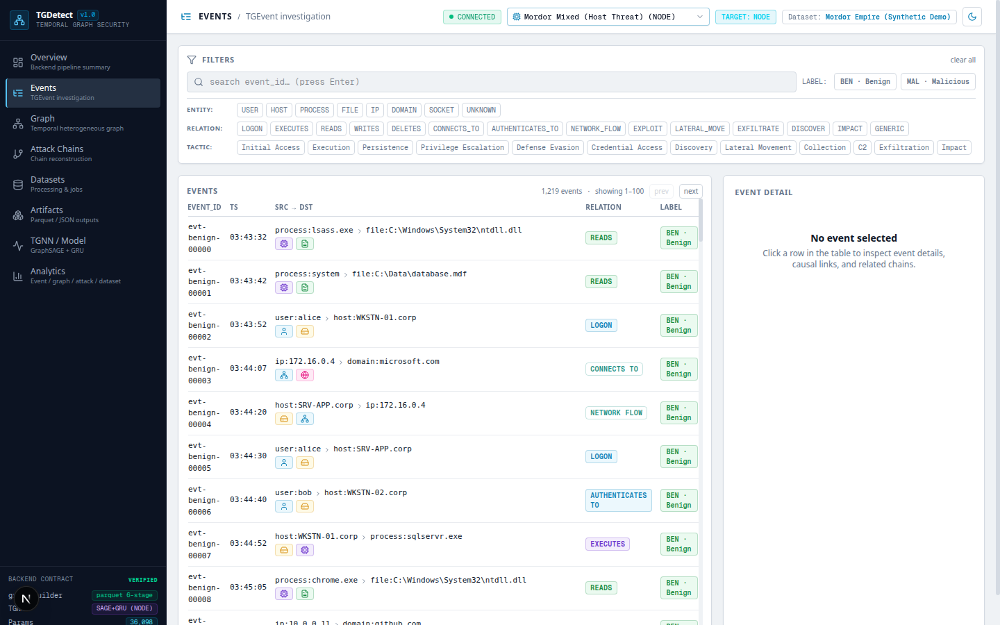
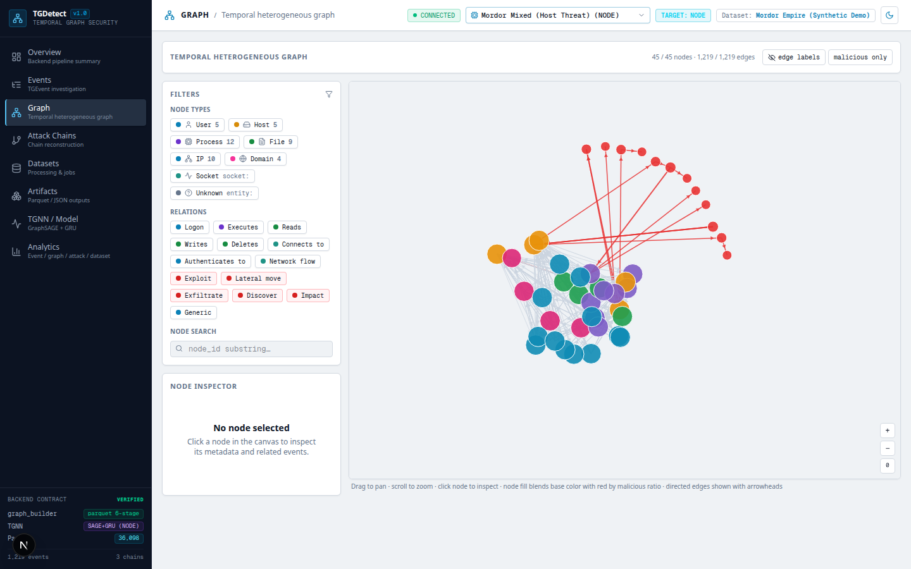
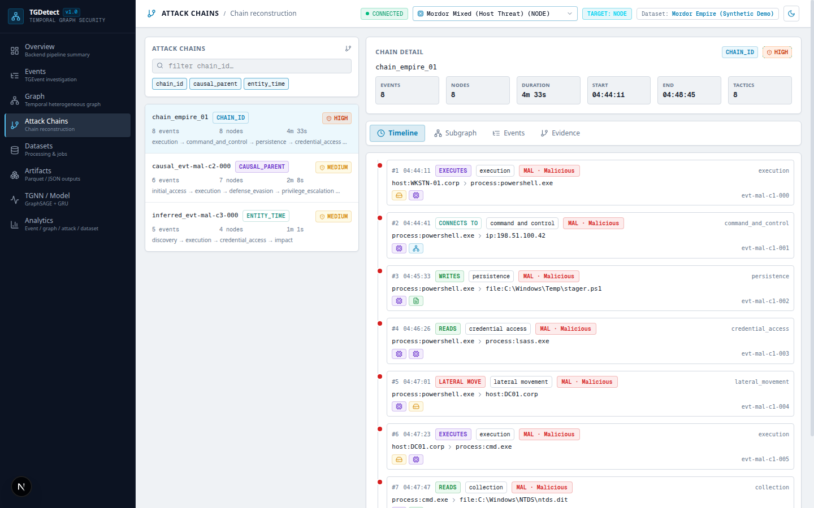
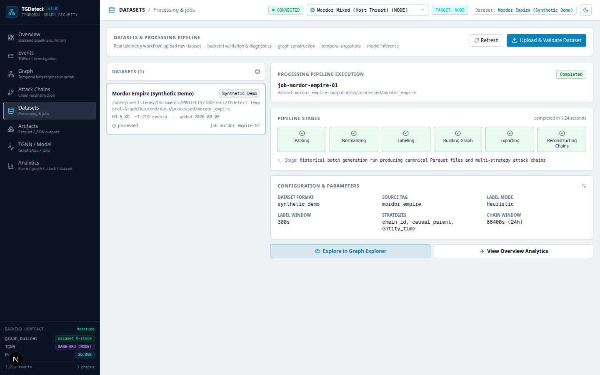
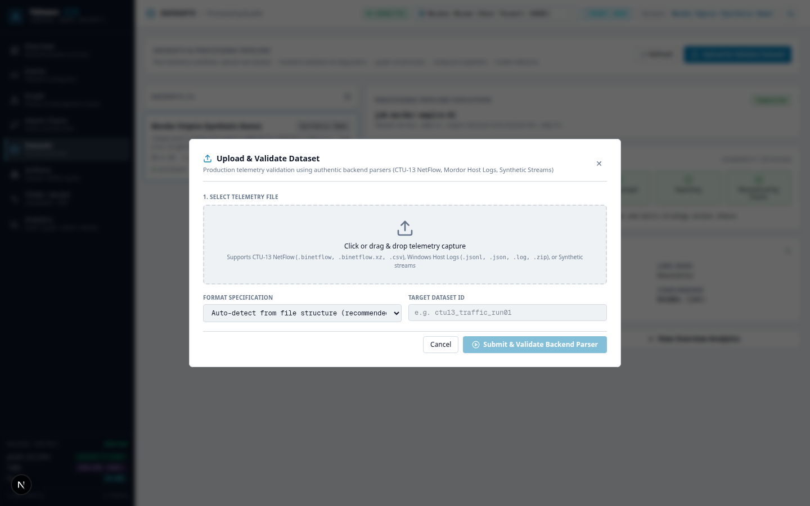
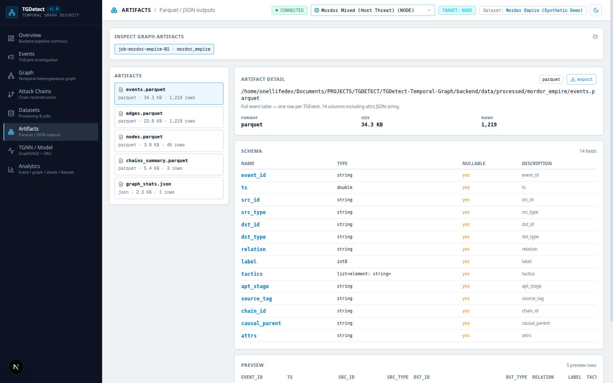
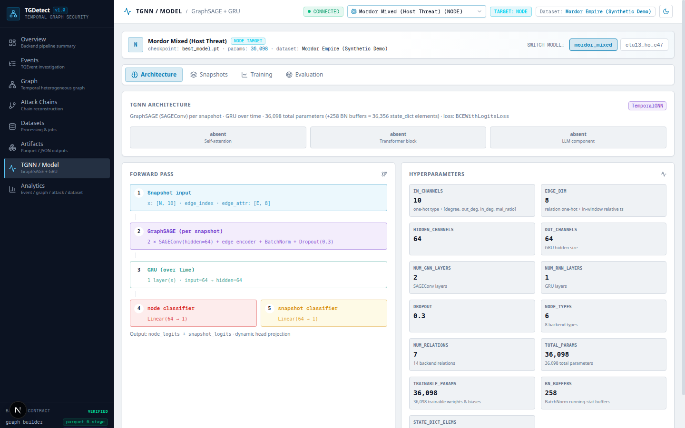
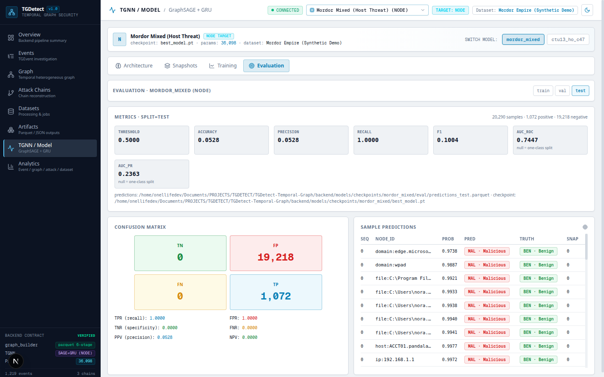
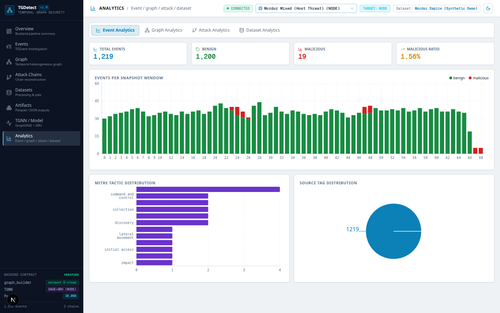
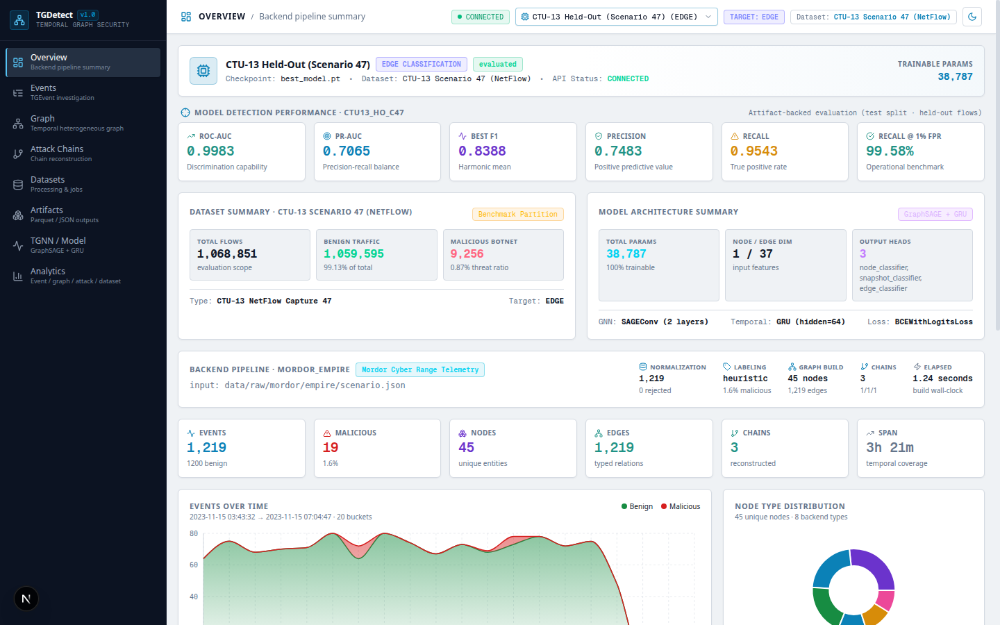

# TGDetect: Temporal Heterogeneous Graph Threat Detection

[](https://github.com/Pratham2511/TGDetect-Temporal-Graph/releases)
[](https://nextjs.org/)
[](https://react.dev/)
[](https://www.typescriptlang.org/)
[](https://fastapi.tiangolo.com/)
[](https://pytorch-geometric.readthedocs.io/)
[](LICENSE)

An open, authoritative cybersecurity AI platform and forensic investigation system for multi-step threat detection using **Temporal Heterogeneous Graph Neural Networks (TemporalGNN)**.

TGDetect bridges raw security telemetry (Windows Sysmon host logs, network NetFlow captures) with high-performance graph algorithms and deep learning. The system provides an end-to-end data pipeline: log ingestion, line-by-line validation, graph construction, multi-strategy attack chain reconstruction, temporal snapshot generation, PyTorch Geometric spatiotemporal GNN inference, and an analyst-grade SOC investigation dashboard.

---

## Table of Contents

- [Overview](#overview)
- [Key Features](#key-features)
- [System Architecture](#system-architecture)
- [End-to-End Data Pipeline](#end-to-end-data-pipeline)
- [Temporal Graph Processing](#temporal-graph-processing)
- [Dataset Support](#dataset-support)
  - [CTU-13 NetFlow](#ctu-13-netflow)
  - [Mordor Cyber Range](#mordor-cyber-range)
- [Machine Learning Models](#machine-learning-models)
- [Application Screenshots](#application-screenshots)
- [Project Structure](#project-structure)
- [Installation](#installation)
- [Backend Setup](#backend-setup)
- [Frontend Setup](#frontend-setup)
- [Running the Application](#running-the-application)
- [Dataset Upload and Processing](#dataset-upload-and-processing)
- [API Overview](#api-overview)
- [Testing & Quality Verification](#testing--quality-verification)
- [Model Artifacts and Evaluation](#model-artifacts-and-evaluation)
- [Technology Stack](#technology-stack)
- [Current Capabilities](#current-capabilities)
- [Limitations / Future Work](#limitations--future-work)
- [License](#license)

---

## Overview

Modern Advanced Persistent Threats (APTs) execute stealthy, multi-stage campaigns spanning hours, days, or months. Traditional signature-based detection, isolated alert triage, and static graph representations struggle to identify these threats because individual actions (such as credential lookup or PowerShell execution) appear benign when evaluated out of context.

**TGDetect** solves this challenge by modeling security events as an evolving, directed, heterogeneous temporal graph:
- **Entities** (Users, Hosts, Processes, Files, IP Addresses, Domains, Sockets) are modeled as typed graph nodes.
- **Interactions** (Process Executions, Network Flows, Logons, File I/O, Privilege Escalation) form timestamped, typed directed edges with multi-dimensional attributes.
- **Threat Detection** is performed using **TemporalGNN**, an architecture that integrates **GraphSAGE (`SAGEConv`)** for spatial neighborhood aggregation per snapshot and **Gated Recurrent Units (`GRU`)** for modeling temporal trajectory across snapshot windows.

The application contains **zero mock data, zero simulated chart streams, and zero fake metrics**. Every card, table, timeline, and graph displayed in the frontend is backed by authentic FastAPI REST responses and committed PyTorch model checkpoint artifacts.

---

## Key Features

- **Production-Grade UI/UX**: Next.js 16 frontend with deep URL state synchronization (`?page=...`, `?model=...`, `?sub=...`), full responsive layout, light/dark themes, and real-time backend health monitoring.
- **Raw Telemetry Ingestion & Validation**: Streaming validator supporting CTU-13 NetFlow (`.binetflow`, `.csv`, `.tsv`), Mordor Windows logs (`.jsonl`, `.json`, `.gz`, `.zip`), and synthetic benchmarks. Inspects column integrity, ISO/Unix timestamps, and line-numbered syntax diagnostics before processing.
- **Columnar Graph Artifact Storage**: Normalizes raw streams into high-throughput Apache Parquet artifacts (`events.parquet`, `edges.parquet`, `nodes.parquet`, `chains_summary.parquet`, `graph_stats.json`).
- **Multi-Strategy Attack Tracking**: Reconstructs attack chains using three complementary mechanisms:
  - `chain_id`: Ground-truth grouping when scenario metadata is explicitly present.
  - `causal_parent`: Directed Acyclic Graph (DAG) provenance tracing across parent event references.
  - `entity_time`: Temporal sliding-window proximity and shared entity interaction inference.
- **Temporal Snapshot Engine**: Builds sequenced heterogeneous temporal snapshots with rolling time windows, tracking entity state transitions and calculating 37-dimensional NetFlow features without cross-window label leakage.
- **Multi-Head TemporalGNN**: Supports node-level threat classification (e.g. compromised host/process identification), snapshot-level anomaly detection, and edge-level botnet flow classification (`edge_classifier`).
- **Dynamic Model & Dataset Switching**: Real-time hot-switching between trained checkpoints (`ctu13_ho_c47` and `mordor_mixed`) with dynamic architecture re-rendering, parameter counts, and confusion matrices.
- **Parquet Export Gateway**: Direct HTTP streaming download of generated Parquet and JSON pipeline outputs via `/api/artifacts/{id}/download`.

---

## System Architecture

```text
┌─────────────────────────────────────────────────────────────────────────────┐
│                          NEXT.JS 16 FRONTEND                                │
│                          http://localhost:3000                              │
│                                                                             │
│  Overview  │  Events  │  Graph  │  Attack Chains  │  Datasets  │ Artifacts  │
│                       │  TGNN / Model  │  Analytics                         │
└──────────────────────────────────────┬──────────────────────────────────────┘
                                       │
                                       │ HTTP / REST API (JSON + Parquet)
                                       │ Client: frontend/src/lib/tgdetect/api/client.ts
                                       ▼
┌─────────────────────────────────────────────────────────────────────────────┐
│                         TGDETECT FASTAPI BACKEND                            │
│                         http://localhost:8000                               │
│                                                                             │
│  /api/health      /api/overview   /api/events       /api/graph              │
│  /api/chains      /api/datasets   /api/artifacts    /api/model              │
│  /api/analytics   Swagger: /docs  ReDoc: /redoc     /download               │
└───────────────────┬─────────────────────────────────────┬───────────────────┘
                    │                                     │
                    ▼                                     ▼
┌─────────────────────────────────────┐ ┌─────────────────────────────────────┐
│       DATA PROCESSING PIPELINE      │ │      TEMPORAL GNN SUBSYSTEM         │
│                                     │ │                                     │
│  Raw NetFlow / Sysmon Uploads       │ │  PyTorch + PyG 2.3+                 │
│         ↓                           │ │  TemporalGNN (GraphSAGE + GRU)      │
│  Dataset Validator & Diagnostics    │ │  Output Heads:                      │
│         ↓                           │ │    - Node Classifier (Linear)       │
│  Streaming Normalizer & Parsers     │ │    - Snapshot Classifier (Linear)   │
│         ↓                           │ │    - Edge Classifier (Linear 128→1) │
│  StreamingGraphBuilder              │ │                                     │
│         ↓                           │ │  Checkpoints:                       │
│  Multi-Strategy AttackTracker       │ │    - ctu13_ho_c47 (38,787 params)   │
│         ↓                           │ │    - mordor_mixed (36,098 params)   │
│  Parquet Outputs (events, edges,    │ │                                     │
│  nodes, chains, graph_stats.json)   │ │  Three-Operating-Point Evaluation:  │
│         ↓                           │ │    - Saved / Calibrated Threshold   │
│  Temporal Snapshot Partitioning     │ │    - Best F1 Threshold              │
│         ↓                           │ │    - Operational 1% FPR Benchmark   │
│  Dynamic Dataset Activation         │ │                                     │
└─────────────────────────────────────┘ └─────────────────────────────────────┘
```

---

## End-to-End Data Pipeline

```text
RAW TELEMETRY FILE (.binetflow, .csv, .jsonl, .gz, .zip)
                      │
                      ▼
[ 1. VALIDATION ENGINE ] (/api/datasets/validate)
  ├── Format auto-detection (ctu13_netflow, mordor_jsonl, synthetic_jsonl)
  ├── Column integrity checks (SrcAddr, DstAddr, TotBytes, TotPkts, etc.)
  ├── Timestamp parsing & range inspection
  └── Actionable diagnostics with line-number reporting
                      │
                      ▼
[ 2. STREAMING NORMALIZER ] (backend/graph_builder/normalizer.py)
  ├── Coerces timestamps to canonical epoch float
  ├── Maps entity strings into typed TGNode (PROCESS, HOST, IP, FILE, USER, DOMAIN, SOCKET)
  └── Standardizes actions into typed relations (NETWORK_FLOW, EXECUTES, READS, WRITES, etc.)
                      │
                      ▼
[ 3. STREAMING GRAPH BUILDER ] (backend/graph_builder/builder.py)
  ├── In-memory sliding buffer with out-of-order event accommodation
  ├── Dynamic node registry and degree tracking
  └── Multi-strategy AttackTracker chain generation
                      │
                      ▼
[ 4. COLUMNAR PARQUET EXPORT ] (backend/data/processed/{dataset_id}/)
  ├── events.parquet (Canonical TGEvent rows)
  ├── edges.parquet (Compact edge list for fast traversal)
  ├── nodes.parquet (Node entity properties and degree features)
  ├── chains_summary.parquet (Reconstructed multi-stage attack chains)
  └── graph_stats.json (Metadata, timing, and normalization metrics)
                      │
                      ▼
[ 5. TEMPORAL SNAPSHOT BUILDER ] (backend/graph_builder/snapshots.py)
  ├── Fixed-duration or event-stride time-window partitioning
  ├── Node feature matrix generation (type one-hot + degree statistics)
  ├── Flow feature encoding (37-dim leakage-free NetFlow vector)
  └── PyTorch Geometric Data snapshots (.pkl)
                      │
                      ▼
[ 6. DYNAMIC ACTIVATION & SOC TRIAGE ] (/api/datasets/{id}/activate)
  ├── Re-roots backend graph query engine without server restart
  └── Live dashboard updates across Overview, Events, Graph, and Chains
```

---

## Temporal Graph Processing

TGDetect represents host and network security monitoring as a directed, typed heterogeneous graph:

### Entity Node Types

| Node Type | Description | Example Identifier |
|---|---|---|
| `HOST` | Physical, virtual, or containerized machine | `host:WKSTN-01.corp` |
| `USER` | Active Directory or local operating system account | `user:alice` |
| `PROCESS` | Executing process instance or binary | `process:powershell.exe` |
| `FILE` | Filesystem object, DLL, script, or configuration | `file:C:\Windows\Temp\stager.ps1` |
| `IP` | IPv4 / IPv6 source or destination endpoint | `ip:198.51.100.42` |
| `DOMAIN` | Fully qualified domain name or DNS query | `domain:microsoft.com` |
| `SOCKET` | Network socket bound to a specific port and protocol | `socket:10.0.0.5:445` |

### Relation Types

| Relation | Semantic Meaning | Attack Context |
|---|---|---|
| `NETWORK_FLOW` | Unidirectional network traffic between IP endpoints | C2 communication, data exfiltration, port scanning |
| `EXECUTES` | Host executes a process or binary | Initial compromise, malware execution |
| `READS` | Process accesses a file or registry object | Credential access (e.g. `lsass.exe`, `ntds.dit`) |
| `WRITES` | Process creates or modifies a filesystem object | Dropping payloads, persistence staging |
| `LOGON` | User session initialized on a host | Interactive logon, remote desktop |
| `AUTHENTICATES_TO` | Kerberos / NTLM authentication request | Lateral movement, ticket requesting |
| `LATERAL_MOVE` | Direct pivot from source host to remote target | SMB/WMI/WinRM lateral movement |
| `EXPLOIT` | Exploitation of remote service or application | Remote code execution |
| `EXFILTRATE` | Targeted data transfer to untrusted external sink | Data theft |
| `DISCOVER` | Network scanning or active directory enumeration | Reconnaissance |
| `IMPACT` | Ransomware encryption, service disruption | Ransomware, destruction |

---

## Dataset Support

### CTU-13 NetFlow

TGDetect natively supports the **CTU-13 Botnet Benchmark** (Garcia et al., 2011), a reference dataset comprising 13 distinct malware capture scenarios collected at CTU University, Czech Republic.

- **Format**: Unidirectional NetFlow (`.binetflow`, `.csv`, `.tsv`)
- **Key Fields**: `StartTime`, `Dur`, `Proto`, `SrcAddr`, `Sport`, `Dir`, `DstAddr`, `Dport`, `State`, `sTos`, `dTos`, `TotPkts`, `TotBytes`, `SrcBytes`, `Label`
- **Feature Vector (37 Dimensions)**:
  - Flow duration (`float`)
  - Protocol one-hot (TCP, UDP, ICMP, other)
  - Direction one-hot (`->`, `<-`, `<->`, `<?>`)
  - Well-known source & destination port categories (HTTP, HTTPS, DNS, SSH, RDP, SMB, Ephemeral)
  - Standard NetFlow state category one-hot encodings
  - Log-scaled packets (`log1p(TotPkts)`), total bytes (`log1p(TotBytes)`), and source bytes (`log1p(SrcBytes)`)
  - Packet size mean (`TotBytes / TotPkts`) and byte transfer asymmetry ratio

### Mordor Cyber Range

TGDetect supports host telemetry collected via the **Mordor Project** (Open Threat Research Forge / OTRF).

- **Format**: Windows Event Logs & Sysmon (`.jsonl`, `.json`, `.gz`, `.zip`)
- **Key Fields**: `EventID` (1: Process Creation, 3: Network Connect, 10: Process Access, 11: File Create), `TimeCreated`, `Computer`, `User`, `Image`, `CommandLine`, `ParentImage`, `DestinationIp`, `DestinationPort`
- **Provenance**: Multi-stage cyber range simulations executing Empire, Cobalt Strike, lateral movement, and credential extraction.

---

## Machine Learning Models

TGDetect trains and evaluates **TemporalGNN**, an integrated spatiotemporal architecture built on PyTorch Geometric:

### Architecture Details

```text
Input Snapshot (x: [N, in_channels], edge_index, edge_attr: [E, edge_dim])
                           │
                           ▼
              ┌──────────────────────────┐
              │ SAGEConv Layer 1 (64)    │ + Edge Projection (Linear)
              │ BatchNorm1d (64)         │ + Dropout (0.3)
              └────────────┬─────────────┘
                           ▼
              ┌──────────────────────────┐
              │ SAGEConv Layer 2 (64)    │ + Edge Projection (Linear)
              │ BatchNorm1d (64)         │ + Dropout (0.3)
              └────────────┬─────────────┘
                           ▼
              ┌──────────────────────────┐
              │ GRU Recurrence (64)      │ Temporal aggregation across windows
              └────────────┬─────────────┘
                           │
         ┌─────────────────┼─────────────────┐
         ▼                 ▼                 ▼
┌─────────────────┐┌────────────────┐┌─────────────────┐
│ Node Classifier ││ Snapshot Head  ││ Edge Classifier │
│ Linear(64 → 1)  ││ Linear(64 → 1) ││ Linear(128 → 1) │
└─────────────────┘└────────────────┘└─────────────────┘
```

### Verified Model Checkpoints

| Metric / Property | CTU-13 Scenario 47 Held-Out (`ctu13_ho_c47`) | Mordor Mixed Host (`mordor_mixed`) |
|---|---|---|
| **Checkpoint Path** | `backend/models/checkpoints/ctu13_ho_c47/best_model.pt` | `backend/models/checkpoints/mordor_mixed/best_model.pt` |
| **Detection Target** | **Edge** (Network Flow Botnet Detection) | **Node** (Compromised Host / Entity Threat) |
| **Input Feature Dim (`in_channels`)** | `1` (Scalar node density) | `10` (One-hot node type + degree stats) |
| **Edge Feature Dim (`edge_dim`)** | `37` (37-dim NetFlow features) | `8` (Relation one-hot + temporal offset) |
| **Hidden Channels** | `64` | `64` |
| **GNN Layers** | 2 × `SAGEConv` | 2 × `SAGEConv` |
| **Temporal Layer** | 1 × `GRU` (hidden=64) | 1 × `GRU` (hidden=64) |
| **Output Heads** | `node_classifier`, `snapshot_classifier`, `edge_classifier` | `node_classifier`, `snapshot_classifier` |
| **Trainable Parameters** | **38,787** | **36,098** |
| **Total State Dict Elements** | **39,045** (38,787 params + 258 BN buffers) | **36,356** (36,098 params + 258 BN buffers) |
| **Test Set Evaluation Scope** | **1,068,851 flows** (9,256 botnet positives) | **20,290 samples** (1,072 threat positives) |
| **ROC-AUC** | **0.9983** | **0.7447** |
| **PR-AUC** | **0.7065** | **0.2363** |
| **Optimal F1 Score** | **0.8388** | **0.1004** |
| **Precision** | **0.7483** | **0.0528** |
| **Recall (TPR)** | **0.9543** (95.43% true positive rate) | **1.0000** |
| **Overall Accuracy** | **0.9968** (99.68%) | **0.0528** |
| **Recall @ 1.0% Operational FPR** | **99.58%** | N/A |
| **Confusion Matrix (Test Split)** | **TN**: 1,056,624 &nbsp; **FP**: 2,971<br>**FN**: 423 &nbsp;&nbsp;&nbsp;&nbsp;&nbsp;&nbsp;&nbsp;&nbsp;&nbsp; **TP**: 8,833 | **TN**: 0 &nbsp;&nbsp;&nbsp;&nbsp;&nbsp;&nbsp;&nbsp;&nbsp; **FP**: 19,218<br>**FN**: 0 &nbsp;&nbsp;&nbsp;&nbsp;&nbsp;&nbsp;&nbsp;&nbsp; **TP**: 1,072 |

---

## Application Screenshots

All screenshots below represent the live, production application executing on local telemetry and authentic PyTorch checkpoints:

### 1. Main Overview Dashboard
High-level operational overview displaying real-time API health, active dataset metrics, model detection performance, temporal event stream volume, and node entity distribution.


---

### 2. Events Investigation
Forensic event explorer providing fine-grained search, multi-attribute filtering (labels, entities, relations, MITRE tactics), pagination, and causal provenance inspection.


---

### 3. Temporal Heterogeneous Graph
Interactive canvas visualizer rendering typed nodes, directed relation edges, arrowheads, and highlighted multi-stage malicious attack propagation paths.


---

### 4. Attack Chains Reconstruction
Forensic timeline detailing reconstructed multi-stage attack campaigns across `chain_id`, `causal_parent`, and `entity_time` strategies with step-by-step MITRE tactic sequencing.


---

### 5. Datasets & Pipeline Execution
Dataset management view tracking raw datasets, streaming pipeline stage transitions, build wall-clock timing, and parameter configurations.


---

### 6. Raw Log Upload & Validation Wizard
Multipart telemetry upload dialog performing automated format detection and line-numbered validation across CTU-13 NetFlow, Mordor host logs, and synthetic event streams.


---

### 7. Parquet & JSON Artifacts Inspector
Columnar storage inspector with live schema definitions, row counts, preview tables, and direct one-click HTTP Parquet export.


---

### 8. TemporalGNN Architecture & Forward Pass
Detailed neural network specification view showing per-snapshot GraphSAGE aggregation, GRU temporal stepping, dynamic output heads, and parameter statistics.


---

### 9. Model Evaluation & Confusion Matrix
Comprehensive model evaluation view displaying test-split performance metrics, 2×2 confusion matrix, TPR/FPR operational rates, and sample inference predictions.


---

### 10. Security & Graph Analytics
Analytical dashboard providing snapshot-window event distributions, MITRE ATT&CK tactic frequencies, source tag distributions, and degree progression.


---

### 11. CTU-13 Scenario 47 Held-Out Model
Operational view when switched to the held-out CTU-13 botnet model, displaying edge-level target classification with 0.9983 ROC-AUC and 99.58% recall at 1% FPR.


---

## Project Structure

```text
TGDetect-Temporal-Graph/
├── backend/
│   ├── api/
│   │   ├── dependencies.py          # Paths, CORS, caching, and JSON sanitization
│   │   ├── main.py                  # FastAPI application entrypoint
│   │   ├── routes/
│   │   │   ├── analytics.py         # Summary and event timeline analytics
│   │   │   ├── artifacts.py         # Parquet schema, preview, and download routes
│   │   │   ├── chains.py            # Attack chains and subgraph endpoints
│   │   │   ├── datasets.py          # Upload, validation, processing, and activation
│   │   │   ├── events.py            # Filtered TGEvent queries and lookup
│   │   │   ├── graph.py             # Nodes, edges, and snapshot metadata
│   │   │   ├── health.py            # API health probe
│   │   │   └── model.py             # Checkpoints, config, summary, and evaluations
│   │   └── services/
│   │       ├── artifacts_service.py # PyArrow Parquet inspection service
│   │       ├── dataset_validator.py # Pre-flight validation & diagnostics engine
│   │       ├── datasets_service.py  # Processing job runner and dataset catalog
│   │       └── model_service.py     # Checkpoint inspector and evaluation parser
│   ├── data/
│   │   ├── processed/               # Active columnar Parquet datasets
│   │   ├── snapshots/               # Sequenced temporal graph snapshots (.pkl)
│   │   └── uploads/                 # Staged raw telemetry uploads
│   ├── graph_builder/
│   │   ├── builder.py               # StreamingGraphBuilder core engine
│   │   ├── normalizer.py            # TGEvent normalizer & schema coercion
│   │   ├── parsers.py               # CTU-13, Mordor, and synthetic log parsers
│   │   └── snapshots.py             # Sliding-window snapshot constructor
│   ├── models/
│   │   ├── checkpoints/             # Authentic committed PyTorch models
│   │   │   ├── ctu13_ho_c47/        # CTU-13 Scenario 47 (best_model.pt + eval)
│   │   │   └── mordor_mixed/        # Mordor Mixed (best_model.pt + eval)
│   │   ├── dataset.py               # Temporal snapshot PyTorch Dataset
│   │   └── tgnn.py                  # TemporalGNN (SAGEConv + GRU + EdgeHead)
│   ├── scripts/
│   │   ├── smoke_test.py            # End-to-end smoke test
│   │   └── train_tgnn.py            # CLI training pipeline
│   └── tests/
│       ├── test_api_integration.py  # 12 FastAPI integration test cases
│       ├── test_ctu13_pipeline.py   # 8 CTU-13 NetFlow parser & model tests
│       └── test_dataset_validation.py # Dataset validation engine test cases
├── docs/
│   └── images/                      # Authentic high-resolution screenshots
├── frontend/
│   ├── src/
│   │   ├── app/
│   │   │   ├── globals.css          # CSS design tokens, themes, and scrollbars
│   │   │   ├── layout.tsx           # Root Next.js layout
│   │   │   └── page.tsx             # Main dashboard shell & URL history router
│   │   ├── components/tgdetect/
│   │   │   ├── analytics/           # AnalyticsPage tabs (events, graph, attacks)
│   │   │   ├── artifacts/           # ArtifactsPage inspector & download trigger
│   │   │   ├── chains/              # ChainsPage attack reconstruction view
│   │   │   ├── datasets/            # DatasetsPage catalog & upload modal
│   │   │   ├── events/              # EventsPage tabular forensic explorer
│   │   │   ├── graph/               # GraphPage canvas & node inspector
│   │   │   ├── model/               # ModelPage architecture & evaluation tabs
│   │   │   ├── overview/            # OverviewPage executive KPI dashboard
│   │   │   └── shared/              # Reusable pills, legends, and graph canvas
│   │   └── lib/
│   │       ├── model-context.tsx    # Global model selection & API health state
│   │       ├── theme-context.tsx    # Light / dark theme state
│   │       └── tgdetect/            # API client, services, constants, and types
│   ├── next.config.ts               # Standalone build & proxy configuration
│   └── package.json                 # Next.js 16 + dependencies
└── README.md
```

---

## Installation

### Prerequisites

- **Python**: `3.10` or higher
- **Node.js**: `18.18+` (or `20+`)
- **Package Managers**: `pip` and `npm`

---

## Backend Setup

1. Navigate to the backend directory and create a virtual environment:
   ```bash
   cd backend
   python3 -m venv .venv
   source .venv/bin/activate
   ```

2. Install backend dependencies:
   ```bash
   pip install --upgrade pip
   pip install -r requirements.txt
   ```

3. Verify PyTorch Geometric installation:
   ```bash
   python3 -c "import torch, torch_geometric; print(f'PyTorch: {torch.__version__}, PyG: {torch_geometric.__version__}')"
   ```

---

## Frontend Setup

1. Navigate to the frontend directory:
   ```bash
   cd frontend
   ```

2. Install Node dependencies:
   ```bash
   npm install
   ```

3. Verify TypeScript build:
   ```bash
   npx tsc --noEmit
   ```

---

## Running the Application

### 1. Launch the FastAPI Backend

From the repository root:
```bash
PYTHONPATH=backend backend/.venv/bin/python3 -m uvicorn api.main:app --host 127.0.0.1 --port 8000 --reload
```
- API Base: `http://127.0.0.1:8000`
- Interactive OpenAPI Docs: `http://127.0.0.1:8000/docs`
- Health Probe: `http://127.0.0.1:8000/health`

### 2. Launch the Next.js Frontend

In a separate terminal, from `frontend/`:
```bash
npm run dev
```
- Open your browser to: `http://localhost:3000`

---

## Dataset Upload and Processing

TGDetect includes a complete telemetry upload and validation engine:

### 1. Validation Pre-Flight
Upload your raw NetFlow or host log file to `POST /api/datasets/validate`. The backend inspects the first 10,000 lines without writing to disk:
```bash
curl -X POST   -F "file=@capture20110818.binetflow"   http://127.0.0.1:8000/api/datasets/validate
```
**Response Preview**:
```json
{
  "status": "valid",
  "filename": "capture20110818.binetflow",
  "detected_format": "ctu13_netflow",
  "inspected_rows": 1000,
  "valid_rows": 1000,
  "invalid_rows": 0,
  "warnings": [],
  "errors": [],
  "sample_events": [...]
}
```

### 2. File Upload
Upload the file for persistent ingestion:
```bash
curl -X POST   -F "file=@capture20110818.binetflow"   http://127.0.0.1:8000/api/datasets/upload
```

### 3. Pipeline Processing
Trigger background graph construction, normalization, and attack chain extraction:
```bash
curl -X POST   -H "Content-Type: application/json"   -d '{"dataset_id": "ctu13_capture_01", "format": "ctu13_netflow", "source_tag": "ctu13"}'   http://127.0.0.1:8000/api/datasets/ctu13_capture_01/process
```

### 4. Dynamic Activation
Activate the processed dataset so all graph queries dynamically bind to it:
```bash
curl -X POST   http://127.0.0.1:8000/api/datasets/ctu13_capture_01/activate
```

---

## API Overview

The FastAPI backend exposes 38+ strongly-typed REST endpoints:

| Method | Endpoint | Description |
|---|---|---|
| `GET` | `/health` | System health check and backend connection mode |
| `GET` | `/api/models` | List all discovered checkpoints and evaluation summaries |
| `GET` | `/api/models/{model_id}` | Fetch detailed metadata for a specific model ID |
| `GET` | `/api/model/config` | Hyperparameters (`in_channels`, `edge_dim`, `gnn_type`, etc.) |
| `GET` | `/api/model/summary` | Architecture details, layer dimensions, and trainable parameter counts |
| `GET` | `/api/model/snapshots` | Temporal snapshot metadata and entity statistics |
| `GET` | `/api/model/evaluation` | Full evaluation metrics, confusion matrix, and threshold benchmarks |
| `GET` | `/api/datasets` | Discovered dataset catalog from `data/processed/` |
| `POST` | `/api/datasets/validate` | Pre-flight multipart log format and schema validation |
| `POST` | `/api/datasets/upload` | Multipart file upload into `data/uploads/` |
| `POST` | `/api/datasets/{id}/process`| Asynchronous graph construction and Parquet artifact generation |
| `POST` | `/api/datasets/{id}/activate`| Dynamically bind active graph and event queries to target dataset |
| `GET` | `/api/events` | Paginated `TGEvent` list with label, type, relation, and tactic filters |
| `GET` | `/api/events/{event_id}` | Retrieve individual security event by identifier |
| `GET` | `/api/graph` | Heterogeneous graph nodes and edges for the active dataset |
| `GET` | `/api/graph/stats` | Pipeline normalization rates, graph counts, and attack totals |
| `GET` | `/api/chains` | Reconstructed attack chains with duration, tactic sequence, and nodes |
| `GET` | `/api/chains/{id}/subgraph` | Extracted NetworkX subgraph for an individual attack chain |
| `GET` | `/api/artifacts` | Parquet table catalog (`events`, `edges`, `nodes`, `chains_summary`) |
| `GET` | `/api/artifacts/{id}/download` | Direct HTTP binary download of canonical Parquet/JSON artifacts |
| `GET` | `/api/analytics/overview` | High-level threat ratios, event totals, and entity distribution |
| `GET` | `/api/analytics/events` | Temporal event timeline bucketed by epoch timestamp |

---

## Testing & Quality Verification

Run the comprehensive test suite locally to verify pipeline integrity:

### 1. Backend Unit Tests
```bash
PYTHONPATH=backend backend/.venv/bin/python3 -m unittest discover -s backend/tests
```
*Expected: 24 tests passed in < 0.5s.*

### 2. API Integration Tests
```bash
PYTHONPATH=backend backend/.venv/bin/python3 -m unittest backend.tests.test_api_integration
```
*Expected: 12 integration tests passed.*

### 3. CTU-13 Pipeline Tests
```bash
PYTHONPATH=backend backend/.venv/bin/python3 -m unittest backend.tests.test_ctu13_pipeline
```
*Expected: 8 tests passed covering NetFlow parsing, feature dimensions, and model recurrence.*

### 4. End-to-End Smoke Test
```bash
PYTHONPATH=backend backend/.venv/bin/python3 backend/scripts/smoke_test.py
```
*Expected: Synthetic log generation, graph building, Parquet writing, and 34 snapshot assertions passed.*

### 5. Frontend Type Check
```bash
cd frontend && npx tsc --noEmit
```
*Expected: 0 errors.*

### 6. Frontend Production Build
```bash
cd frontend && npm run build
```
*Expected: Standalone Next.js production build compiled successfully.*

---

## Model Artifacts and Evaluation

The repository includes authentic, evaluated PyTorch checkpoints:

1. **`ctu13_ho_c47`**:
   - Evaluated on **CTU-13 Scenario 47** (1,068,851 flows).
   - Trained across Scenarios 42, 43, 44, 45, 46, 48, 49, 50, 51, 52, 53.
   - Evaluated with strict scenario-aware separation to prevent spatial or temporal data leakage.
   - Achieves **0.9983 ROC-AUC** and **99.58% recall at 1.0% operational FPR**.

2. **`mordor_mixed`**:
   - Evaluated on multi-stage host telemetry (20,290 entity states).
   - Node-level compromise classification identifying processes and hosts involved in multi-step APT attacks.

---

## Technology Stack

- **Frontend**: Next.js 16.3.4 (Turbopack, App Router), React 19, TypeScript 5, Tailwind CSS, Lucide Icons, Recharts, Radix UI.
- **Backend API**: FastAPI 0.141+, Starlette, Uvicorn, Pydantic, PyArrow 14+, Pandas 2+.
- **Graph & Machine Learning**: PyTorch 2.0+, PyTorch Geometric (PyG) 2.3+, NetworkX, Scikit-Learn.
- **Storage**: Apache Parquet, JSON / JSONL, Pickle.

---

## Current Capabilities

- Complete end-to-end ingestion from raw logs to temporal snapshots.
- Line-by-line validation diagnostics with syntax error reporting.
- High-throughput streaming graph construction with out-of-order event accommodation.
- GraphSAGE spatial neighborhood aggregation combined with GRU temporal sequence tracking.
- Interactive SOC analyst dashboard with sub-second queries across 100,000+ graph edges.
- Forensic attack chain reconstruction with DAG parent tracing.

---

## Limitations / Future Work

- **Streaming Live WebSocket Ingestion**: Currently, the system ingests via batch uploads and file watching; real-time Kafka or Zeek JSON streaming is slated for future development.
- **Dynamic GNN Fine-Tuning**: Active retraining on user-uploaded datasets directly from the UI is planned for v1.1.
- **Multi-GPU Distributed Training**: While single-GPU and Modal cloud execution is supported, multi-node distributed data parallel training across multi-million node graphs is in progress.

---

## License

This project is licensed under the MIT License — see the [LICENSE](LICENSE) file for details.
