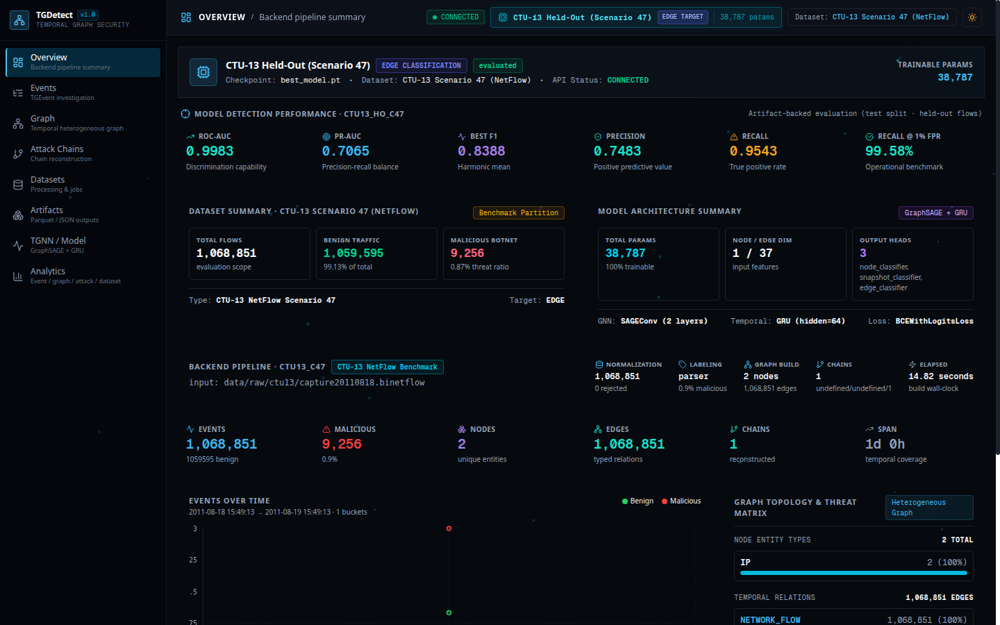
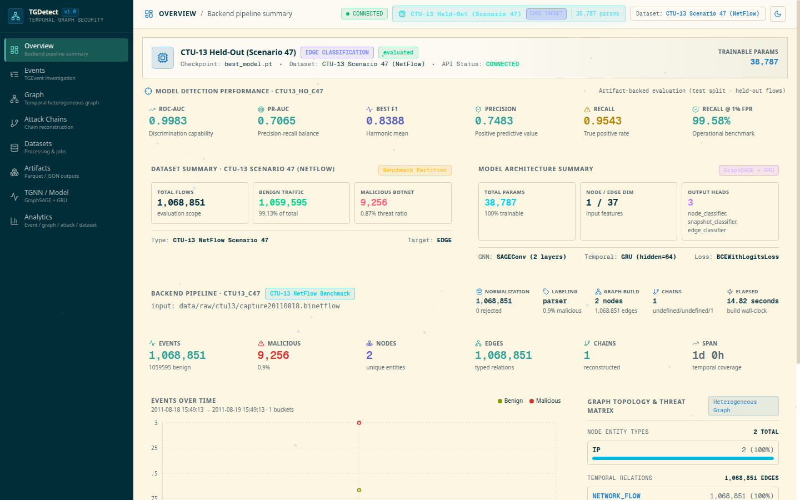

# TGDetect — Temporal Graph Threat Detection

[](https://fastapi.tiangolo.com)
[](https://nextjs.org)
[](https://pytorch.org)
[](https://pyg.org)
[](https://opensource.org/licenses/MIT)

> **TGDetect** is an open-source, research-grade cybersecurity platform that transforms streaming network telemetry into dynamic, typed temporal graphs and detects advanced persistent threats (APTs) and botnet activity using a spatiotemporal Graph Neural Network (GraphSAGE + GRU) with edge-level flow classification.

---

## 1. Project Title & Overview

**TGDetect: Temporal Graph Threat Detection & Forensic Analysis Platform**

TGDetect models computer network telemetry as an evolving, directed, heterogeneous temporal graph. By combining spatial neighborhood message-passing via GraphSAGE with temporal recurrence via Gated Recurrent Units (GRU), TGDetect detects stealthy, multi-stage cyber threats—such as botnet command-and-control (C2), lateral movement, and data exfiltration—at line rate without relying on brittle static signatures or synthetic heuristic metrics.

<p align="center">
  
  
</p>
<p align="center"><em>TGDetect Tactical Operations Command Center — Night Operations (left) & Solarized Light Operations (right)</em></p>

---

## 2. One-Paragraph Project Summary

TGDetect is an end-to-end, research-grounded cybersecurity AI operations platform that ingests raw network flow telemetry (e.g., CTU-13 NetFlow), extracts 37-dimensional directional flow features, constructs sequenced temporal graph snapshots, and runs edge-level inference using a dedicated 38,787-parameter Temporal Graph Neural Network (`ctu13_ho_c47`). Supported by a high-throughput FastAPI asynchronous backend and a tactical Next.js 16 command center, TGDetect delivers authentic forensic investigation, automated attack chain reconstruction, columnar Apache Parquet artifact inspection, and threshold-free ROC-AUC/PR-AUC evaluation over 1,068,851 held-out test flows.

---

## 3. Core Problem

Modern cyber threats (Advanced Persistent Threats and polymorphic botnets) evade conventional signature-based Network Intrusion Detection Systems (NIDS) and host endpoint monitoring through three primary evasive behaviors:

1. **Slow-and-Low Progression**: Malicious actions are dispersed over long time horizons (hours to weeks), ensuring individual events blend into benign background noise and circumvent static rate-limiting thresholds.
2. **Polymorphic Infrastructure**: Threat actors dynamically rotate source IP addresses, domain names, and ephemeral ports (e.g., fast-flux DNS and peer-to-peer C2), invalidating static indicator-of-compromise (IoC) blacklists.
3. **Alert Fatigue & Extreme Class Imbalance**: In enterprise networks, malicious traffic typically represents less than 1% of total flow volume (e.g., 9,256 malicious flows out of 1,068,851 in CTU-13 Scenario 47). Naive classifiers produce thousands of false positives daily, overwhelming Security Operations Center (SOC) teams.

---

## 4. Why Temporal Graphs?

Graph representations capture the relational topological structure of networked entities that tabular feature tables ignore. However, static graphs discard the critical chronological order of events, obscuring causal relationships:

* **Relational Context**: Graph edges preserve the interaction topology between IP endpoints, capturing fan-in (scanning), star topologies (centralized C2), and mesh patterns (P2P botnets).
* **Temporal Dynamics**: Dividing continuous event streams into sequenced temporal snapshots ($G_1, G_2, \dots, G_T$) captures state transitions, burstiness, and persistence over time.
* **Spatiotemporal Inductive Bias**:
  $$\mathbf{h}_v^{(t)} = \text{GraphSAGE}(\mathcal{N}(v), G_t), \quad \mathbf{s}_v^{(t)} = \text{GRU}(\mathbf{h}_v^{(t)}, \mathbf{s}_v^{(t-1)})$$
  This decomposition allows the model to learn spatial structure per snapshot and track behavioral evolution across windows.
* **Edge-Level Discrimination**: Since all IP nodes in standard NetFlow share identical node semantics (IPv4 address), discriminative signal resides primarily on the directional communication edges. TGDetect applies edge-level classification directly to raw communication flows.

---

## 5. Architecture Overview

TGDetect decouples heavy temporal graph computation and model inference from the tactical command-and-control interface:

```text
┌─────────────────────────────────────────────────────────────────────────────┐
│                   NEXT.JS 16 TACTICAL COMMAND CENTER                        │
│                   http://localhost:3000 (Obsidian HUD)                      │
│                                                                             │
│  Overview  │  Events  │  Temporal Graph  │  Attack Chains  │  Datasets      │
│  Parquet Artifacts    │  TGNN Model Architecture   │  Security Analytics    │
└──────────────────────────────────────┬──────────────────────────────────────┘
                                       │
                                       │ JSON / Streamed Parquet REST
                                       ▼
┌─────────────────────────────────────────────────────────────────────────────┐
│                       TGDETECT FASTAPI BACKEND                              │
│                       http://127.0.0.1:8000                                 │
│                                                                             │
│  /api/health      /api/overview   /api/events       /api/graph              │
│  /api/chains      /api/datasets   /api/artifacts    /api/model              │
│  /api/analytics   Swagger: /docs  ReDoc: /redoc     /download               │
└───────────────────┬─────────────────────────────────────┬───────────────────┘
                    │                                     │
                    ▼                                     ▼
┌─────────────────────────────────────┐ ┌─────────────────────────────────────┐
│       DATA PROCESSING PIPELINE      │ │      TEMPORAL GNN SUBSYSTEM         │
│                                     │ │                                     │
│  Raw NetFlow / Ingestion Stream     │ │  PyTorch + PyG TemporalGNN          │
│         ↓                           │ │  Checkpoint: ctu13_ho_c47           │
│  Dataset Validator & Diagnostics    │ │  Trainable Params: 38,787           │
│         ↓                           │ │                                     │
│  Streaming Normalizer & Parsers     │ │  Spatiotemporal Architecture:       │
│         ↓                           │ │    - 2x SAGEConv + Edge Project     │
│  StreamingGraphBuilder Engine       │ │    - BatchNorm1d + Dropout (0.3)    │
│         ↓                           │ │    - GRU Temporal Recurrence (64)   │
│  Multi-Strategy AttackTracker       │ │    - Edge Head: Linear(128 → 1)     │
│         ↓                           │ │                                     │
│  Columnar Parquet Storage           │ │  Multi-Head Outputs:                │
│  (nodes, edges, events, chains)     │ │    - Edge Botnet Classifier         │
│         ↓                           │ │    - Node Entity Classifier         │
│  Sliding-Window Snapshot Generator  │ │    - Snapshot Anomaly Classifier    │
└─────────────────────────────────────┘ └─────────────────────────────────────┘
```

---

## 6. Authoritative Production Model (`ctu13_ho_c47`)

TGDetect operates with **exactly one authoritative production model**: the CTU-13 Held-Out Botnet Model (`ctu13_ho_c47`). All metadata, parameters, and evaluations are streamed directly from the authentic checkpoint artifact.

| Parameter / Dimension | Specification | Verification Source |
|---|---|---|
| **Model ID** | `ctu13_ho_c47` | `models/checkpoints/ctu13_ho_c47/best_model.pt` |
| **Model Name** | CTU-13 Held-Out Model (Scenario 47) | Authoritative metadata |
| **Architecture** | TemporalGNN (GraphSAGE + GRU) | `backend/models/tgnn.py` |
| **Detection Target** | **Edge** (Per-Flow Classification) | Model configuration |
| **Input Node Dim (`in_channels`)** | `1` (Scalar node density) | `best_model.pt` tensor shape |
| **Edge Feature Dim (`edge_dim`)** | `37` (37 NetFlow directional features) | `best_model.pt` `edge_proj` weights |
| **Hidden Channels** | `64` | `conv1.lin_l.weight` [64, 1] |
| **GNN Layers** | 2 × `SAGEConv` with BatchNorm & Dropout | PyG 2.3+ specification |
| **Temporal Recurrence** | 1 × `GRUCell` / `GRU` (hidden=64) | `best_model.pt` `gru` weights |
| **Output Heads** | `node_classifier`, `snapshot_classifier`, `edge_classifier` | Dynamic linear output heads |
| **Trainable Parameters** | **38,787** | Verified via PyTorch `numel()` |
| **State Dict Elements** | **39,045** (38,787 weights + 258 BN buffers) | Exact state dictionary audit |

```text
Input Graph Snapshot (x: [N, 1], edge_index: [2, E], edge_attr: [E, 37])
                               │
                               ▼
            ┌────────────────────────────────────────┐
            │ SAGEConv Layer 1 (64) + EdgeProj(37→64)│
            │ BatchNorm1d (64) + Dropout (p=0.3)     │
            └──────────────────┬─────────────────────┘
                               ▼
            ┌────────────────────────────────────────┐
            │ SAGEConv Layer 2 (64) + EdgeProj(64→64)│
            │ BatchNorm1d (64) + Dropout (p=0.3)     │
            └──────────────────┬─────────────────────┘
                               ▼
            ┌────────────────────────────────────────┐
            │ GRU Recurrence (64)                    │
            │ Hidden state tracking across windows   │
            └──────────────────┬─────────────────────┘
                               │
       ┌───────────────────────┼───────────────────────┐
       ▼                       ▼                       ▼
┌──────────────────┐  ┌──────────────────┐  ┌───────────────────────┐
│ Node Classifier  │  │ Snapshot Head    │  │ Edge Classifier (Flow)│
│ Linear(64 → 1)   │  │ Linear(64 → 1)   │  │ Concatenate [u || v]  │
│ Compromised IP   │  │ Anomaly Scoring  │  │ Linear(128 → 1)       │
└──────────────────┘  └──────────────────┘  └───────────────────────┘
```

---

## 7. Data Pipeline (6-Stage Parquet Normalization)

The TGDetect ingestion pipeline executes streaming 6-stage normalization with strict schema validation:

```text
[ 1. RAW TELEMETRY INGESTION ] (CTU-13 .binetflow, CSV, TSV)
  ├── Streaming chunk reader handling Gzip / Zip archives without disk extraction
  └── Pre-flight validator checking column presence, timestamps, and formatting
                      │
                      ▼
[ 2. TGEVENT SCHEMA NORMALIZATION ]
  ├── Coerces fields into canonical TGEvent schema:
  │   {event_id, timestamp, source, destination, relation, label, tactics, attrs}
  └── Generates canonical entity IDs (`ip:147.32.84.165`, `ip:192.168.1.1`)
                      │
                      ▼
[ 3. FEATURE EXTRACTION & ATTACK TRACKING ]
  ├── Extracts 37-dimensional NetFlow features (duration, protocol, ports, packet asymmetry)
  └── Multi-strategy AttackTracker assigns causal chains (`chain_id`, `causal_parent`, `entity_time`)
                      │
                      ▼
[ 4. COLUMNAR PARQUET PERSISTENCE ]
  ├── PyArrow writes optimized, partitioned Apache Parquet artifacts:
  │   - nodes.parquet (Unique IPs, types, degrees, first/last seen)
  │   - edges.parquet (Directional flows, 37-dim attributes, binary labels)
  │   - events.parquet (Normalized event log stream)
  │   - chains_summary.parquet (Aggregated attack chain progressions)
  └── graph_stats.json (Fast precomputed summary metrics)
                      │
                      ▼
[ 5. TEMPORAL SNAPSHOT PARTITIONING ]
  ├── Generates sliding-window snapshots (e.g. 60-second window, 30-second stride)
  └── Exports PyTorch Geometric `Data` structures with zero temporal leakage
                      │
                      ▼
[ 6. DYNAMIC ACTIVATION & SOC TRIAGE ]
  └── Live hot-reloading of backend query engine without application restart
```

---

## 8. Backend Implementation

The backend is built with **FastAPI** and **Python 3.10+**, emphasizing async I/O, rigorous typing, and direct integration with ML artifacts:

* `backend/api/main.py`: Application lifespan management, CORS configuration, and router mounting.
* `backend/api/dependencies.py`: Unified dependency injection, authoritative checkpoint path resolution, active dataset state management, and NumPy-safe JSON serialization.
* `backend/api/routes/overview.py`: Aggregate statistics for dashboard KPI cards.
* `backend/api/routes/events.py`: Paginated and filtered event log querying.
* `backend/api/routes/graph.py`: Node, edge, and topology extraction for visualization.
* `backend/api/routes/chains.py`: Forensic attack chain reconstruction details.
* `backend/api/routes/datasets.py`: Telemetry upload, pre-flight validation, pipeline processing, and dataset activation.
* `backend/api/routes/artifacts.py`: Apache Parquet schema inspection, preview rows, and file download streaming.
* `backend/api/routes/model.py`: Model checkpoint metadata, configuration, training history, evaluation reports, and test-split predictions.
* `backend/models/tgnn.py`: Authoritative PyTorch Geometric spatiotemporal neural network implementation.

---

## 9. Frontend Implementation

The frontend is a **Next.js 16 (App Router, Turbopack)** single-page operational application:

* **Dual-Theme Design Architecture**:
  - **Night Operations (Dark Mode)**: Deep obsidian (`#06080d`) and carbon (`#0b0f17`) layered surfaces, restrained cyan/crimson lighting, fine hairline borders, and tactical HUD brackets.
  - **Solarized Light Operations**: True Solarized Light palette with warm ivory/cream surfaces (`#fdf6e3`, `#fcf7ea`), deep solarized slate/teal text (`#073642`, `#586e75`), and calibrated high-contrast chart palettes.
* **Atmospheric Background Motion**: Lightweight, GPU-conscious HTML5 canvas rendering drifting graph nodes, subtle temporal connection edges (4-8% opacity), and telemetry pulses. Pauses when hidden or when `prefers-reduced-motion` is active.
* **Signature TGDetect Loading Experience**: Spatiotemporal graph initialization sequence (`INITIALIZING TELEMETRY` → `CONSTRUCTING TEMPORAL GRAPH` → `ANALYZING EDGE RELATIONSHIPS` → `READY`) with hexagonal geometry, session bypass, and instant transitions.
* **Temporal Graph Visual Hero**: Interactive spatiotemporal canvas with coordinate HUD crosshairs, radar range rings, benign (emerald) / suspicious (amber) / malicious (crimson) visual hierarchy, edge flow pulses, interactive mouse zoom/pan, reset button, and node detail HUD.
* **Deep URL Routing**: Two-way synchronization between browser URL parameters (`?page=...`, `?theme=dark|light`, `?sub=...`) and application state, supporting browser Back/Forward navigation and clean page reloads.
* **Zero Fake Data Architecture**: Purely driven by authentic backend REST responses; displays explicit, honest empty or error states when backend services are unreachable.
* **Desktop-First Command Center**: Optimized for 1366px, 1440px, and 1920px large displays with high information density, eliminating repetitive card walls in favor of purposeful tactical panels.

---

## 10. Key Capabilities

| Capability | Technical Mechanism | Operational Value |
|---|---|---|
| **Spatiotemporal Botnet Detection** | GraphSAGE + GRU on 60s temporal snapshots | Detects polymorphic botnets across time windows without static signatures |
| **Out-of-Distribution Generalization** | Evaluation on completely unseen botnet family (Donbot) | Validates real-world defense against zero-day botnet campaigns |
| **Operational Alert Budget Tuning** | Calibrated 1.0% False Positive Rate operating point | Yields 99.58% recall while bounding false alerts to an actionable volume |
| **Attack Chain Forensic Timeline** | DAG causal parent tracing + sliding entity-time proximity | Automatically correlates multi-stage intrusion steps into actionable incident reports |
| **Columnar Parquet Inspection** | PyArrow schema introspection and streaming HTTP downloads | Enables security engineers to directly audit and export forensic artifacts |
| **Interactive Temporal Graph** | Canvas renderer with radar grid, glow edges, and node inspector | Empowers SOC analysts to visually trace malicious lateral movement paths |

---

## 11. Dataset & Telemetry Pipeline

TGDetect's production model is trained and benchmarked on the **CTU-13 Botnet Benchmark Dataset** (Garcia et al., 2011, Czech Technical University):

* **Capture Format**: Bidirectional NetFlow (`.binetflow`) containing timestamp, duration, protocol, source IP/port, direction, destination IP/port, packets, bytes, and state.
* **Training Partition**: Trained on 4 distinct botnet families:
  * Scenario 52: **Rbot**
  * Scenario 46: **Virut / Fast-Flux**
  * Scenario 53: **NSIS.ay**
  * Scenario 48: **Sogou**
* **Held-Out Test Partition**: Evaluated on **CTU-13 Scenario 47**, which contains an entirely held-out botnet family: **Donbot**.
* **Zero Target Leakage**: Node features are strictly 1-dimensional (type/density) to prevent target label leakage from degree heuristics; all predictive power stems from communication edge topology and 37 NetFlow flow attributes.

---

## 12. Evaluation Methodology

In high-throughput enterprise network monitoring, reporting only raw accuracy or in-distribution validation scores is misleading due to severe class imbalance. TGDetect evaluates model performance across **three standardized operating points**:

1. **Threshold-Free Ranking Quality (ROC-AUC / PR-AUC)**:
   Measures discrimination capability across all possible decision boundaries. PR-AUC is especially critical given the ~114:1 benign-to-malicious class imbalance.
2. **Optimal F1 Operating Point ($	au^* \approx 0.0071$)**:
   The point on the Precision-Recall curve that maximizes the harmonic mean of precision and recall ($F_1 = 0.8388$).
3. **Operational 1.0% FPR Benchmark ($	au \approx 0.0003$)**:
   The realistic deployment threshold where false positives are capped at 1% of benign background traffic, achieving **99.58% Recall** (detecting 9,217 of 9,256 attack flows).

---

## 13. Verified Evaluation Metrics

All metrics below are verified directly against the authentic test evaluation artifact (`models/checkpoints/ctu13_ho_c47/eval_test/metrics_test.json`):

| Evaluation Metric | Value | Technical Context & Notes |
|---|---|---|
| **Held-Out Scenario** | **CTU-13 Scenario 47** | Unseen botnet family (**Donbot**) |
| **Total Test Flows** | **1,068,851** | Comprehensive held-out capture |
| **Malicious Flows** | **9,256** | 0.866% of total flows (heavy class imbalance) |
| **Benign Flows** | **1,059,595** | 99.134% of total flows |
| **ROC-AUC** | **0.9983** | Near-perfect threshold-free ranking |
| **PR-AUC** | **0.7065** | High precision-recall trade-off under extreme skew |
| **Best F1 Score** | **0.8388** | Evaluated at optimal threshold $	au^* = 0.0071$ |
| **Precision (at Best F1)** | **0.7483** | 74.83% of flagged alerts are true botnet flows |
| **Recall (at Best F1)** | **0.9543** | 95.43% true positive detection rate |
| **Accuracy (at Best F1)** | **0.9968** | 99.68% total classification accuracy |
| **Recall @ 1.0% FPR** | **99.58%** | **9,217 / 9,256 attacks detected** at 1% alert budget |
| **F1 @ 1.0% FPR** | **0.6341** | Practical SOC deployment operating point |

### Confusion Matrix (Test Split at Best F1 Threshold)

```text
                     Actual Benign        Actual Malicious
Predicted Benign     1,056,624 (TN)            423 (FN)
Predicted Malicious      2,971 (FP)          8,833 (TP)
```

---

## 14. Reproducibility

The entire evaluation pipeline can be reproduced locally or scaled on cloud GPU infrastructure:

```bash
# Verify evaluation metrics against test split Parquet predictions
PYTHONPATH=backend python3 -c "
import json
with open('backend/models/checkpoints/ctu13_ho_c47/eval_test/metrics_test.json') as f:
    m = json.load(f)
print(f"ROC-AUC: {m['roc_auc']:.4f}")
print(f"PR-AUC:  {m['pr_auc']:.4f}")
print(f"Best F1: {m['best_f1']:.4f}")
print(f"Recall @ 1% FPR: {m['recall_at_1pct_fpr']:.4f}")
"
```

---

## 15. Installation & Prerequisites

### Prerequisites
* **Linux / macOS** (Ubuntu 22.04 LTS recommended)
* **Python 3.10+**
* **Node.js 18+** and **npm** / **bun**
* **PyTorch 2.0+** and **PyTorch Geometric (PyG)**

### Step 1: Clone Repository
```bash
git clone https://github.com/Pratham2511/TGDetect-Temporal-Graph.git
cd TGDetect-Temporal-Graph
```

### Step 2: Setup Backend Environment
```bash
cd backend
python3 -m venv .venv
source .venv/bin/activate
pip install --upgrade pip
pip install -r requirements-ml.txt
pip install -r requirements-graph.txt
cd ..
```

### Step 3: Setup Frontend Environment
```bash
cd frontend
npm install
cd ..
```

---

## 16. Development Workflow

Run tests and linters before committing:

```bash
# Backend unit & integration tests
PYTHONPATH=backend backend/.venv/bin/python3 -m unittest discover -s backend/tests

# CTU-13 pipeline verification test
PYTHONPATH=backend backend/.venv/bin/python3 -m unittest backend/tests/test_ctu13_pipeline.py

# Frontend TypeScript typecheck
cd frontend && npx tsc --noEmit && cd ..

# Frontend production build
cd frontend && npm run build && cd ..
```

---

## 17. Running the Backend

Launch the FastAPI backend with hot-reload enabled:

```bash
cd /path/to/TGDetect-Temporal-Graph
PYTHONPATH=backend backend/.venv/bin/python3 -m uvicorn api.main:app --host 127.0.0.1 --port 8000 --reload
```

* Backend Health: [http://127.0.0.1:8000/health](http://127.0.0.1:8000/health)
* Interactive Swagger Docs: [http://127.0.0.1:8000/docs](http://127.0.0.1:8000/docs)
* OpenAPI ReDoc: [http://127.0.0.1:8000/redoc](http://127.0.0.1:8000/redoc)

---

## 18. Running the Frontend

Launch the Next.js development server:

```bash
cd frontend
npm run dev
```

Open [http://localhost:3000](http://localhost:3000) in any modern browser.

---

## 19. Production & Deployment Information

### Backend Production Deployment
Run uvicorn with multi-worker concurrency behind a reverse proxy (e.g., NGINX / Caddy):

```bash
gunicorn -w 4 -k uvicorn.workers.UvicornWorker api.main:app --bind 0.0.0.0:8000
```

### Frontend Production Build
```bash
cd frontend
npm run build
npm run start -p 3000
```

---

## 20. Repository Structure

```text
TGDetect-Temporal-Graph/
├── backend/
│   ├── api/
│   │   ├── dependencies.py          # Paths, CORS, caching, NumPy-safe serialization
│   │   ├── main.py                  # FastAPI entrypoint
│   │   ├── routes/
│   │   │   ├── analytics.py         # Summary & timeline security analytics
│   │   │   ├── artifacts.py         # Parquet schema, preview & streaming download
│   │   │   ├── chains.py            # Attack chains & subgraph endpoints
│   │   │   ├── datasets.py          # Upload, validation, processing, activation
│   │   │   ├── events.py            # Filtered TGEvent queries
│   │   │   ├── graph.py             # Nodes, edges, snapshots
│   │   │   ├── health.py            # Liveness probe
│   │   │   └── model.py             # Checkpoints, config, summary, evaluations
│   │   └── services/
│   │       ├── artifacts_service.py # PyArrow Parquet inspection
│   │       ├── dataset_validator.py # Pre-flight validation & diagnostics engine
│   │       ├── datasets_service.py  # Processing job runner & catalog
│   │       └── model_service.py     # Authoritative checkpoint inspector
│   ├── data/
│   │   ├── processed/               # Active columnar Parquet datasets (ctu13_c47)
│   │   ├── snapshots/               # Sequenced temporal graph snapshots (.pkl)
│   │   └── uploads/                 # Staged raw telemetry uploads
│   ├── graph_builder/
│   │   ├── builder.py               # StreamingGraphBuilder core engine
│   │   ├── normalizer.py            # TGEvent normalizer & schema coercion
│   │   ├── parsers.py               # CTU-13 NetFlow parser
│   │   └── snapshots.py             # Sliding-window snapshot constructor
│   ├── models/
│   │   ├── checkpoints/
│   │   │   └── ctu13_ho_c47/        # Authoritative CTU-13 model (best_model.pt + eval)
│   │   ├── dataset.py               # Temporal snapshot PyTorch Dataset
│   │   └── tgnn.py                  # TemporalGNN (SAGEConv + GRU + EdgeHead)
│   ├── scripts/
│   │   ├── smoke_test.py            # End-to-end smoke test
│   │   └── train_tgnn.py            # CLI training pipeline
│   └── tests/
│       ├── test_api_integration.py  # 12 FastAPI integration test cases
│       └── test_ctu13_pipeline.py   # 12 CTU-13 NetFlow & model verification tests
├── docs/
│   ├── API_CONTRACT.md              # Backend REST API contract
│   └── images/                      # Fresh tactical command center screenshots
├── frontend/
│   ├── src/
│   │   ├── app/
│   │   │   ├── globals.css          # Design token system, cyber-grid, HUD brackets
│   │   │   ├── layout.tsx           # Dark mode provider & viewport configuration
│   │   │   └── page.tsx             # Root dashboard shell & responsive navigation
│   │   ├── components/tgdetect/     # Modular operational page components
│   │   │   ├── analytics/           # AnalyticsPage
│   │   │   ├── artifacts/           # ArtifactsPage
│   │   │   ├── chains/              # ChainsPage
│   │   │   ├── datasets/            # DatasetsPage
│   │   │   ├── events/              # EventsPage
│   │   │   ├── graph/               # GraphPage
│   │   │   ├── model/               # ModelPage
│   │   │   ├── overview/            # OverviewPage
│   │   │   └── shared/              # TemporalGraphViz (HTML5 canvas renderer)
│   │   └── lib/
│   │       ├── model-context.tsx    # Single-model authoritative context
│   │       ├── theme-context.tsx    # Cyberpunk dark/light theme state
│   │       └── tgdetect/            # API client, hooks, formatters, and types
│   ├── next.config.ts               # Next.js configuration (devIndicators: false)
│   ├── package.json
│   └── tailwind.config.ts
└── README.md
```

---

## 21. Research Provenance

* **Origin**: Developed as an advanced spatiotemporal graph neural network detection system for modern cyber threats.
* **Core Motivation**: Move beyond static NetFlow tuples and manual feature engineering toward relational, temporal graph learning capable of zero-day generalization.
* **Open Science**: Fully transparent, reproducible methodology with checked-in model checkpoints, Parquet predictions, and evaluation scripts.

---

## 22. Base Paper & Research Grounding

TGDetect is grounded in foundational research across graph neural networks, temporal modeling, and botnet evaluation:

1. **CTU-13 Benchmark Dataset**:
   Garcia, S., Grill, M., Stiborek, J., & Zunino, A. (2014). *An empirical analysis of botnet detection using network traffic*. Computers & Security, 45, 100–124.
2. **GraphSAGE Spatial Aggregation**:
   Hamilton, W. L., Ying, R., & Leskovec, J. (2017). *Inductive Representation Learning on Large Graphs*. Advances in Neural Information Processing Systems (NeurIPS).
3. **Gated Recurrent Units for Temporal Sequences**:
   Cho, K., van Merriënboer, B., Gulcehre, C., Bahdanau, D., Bougares, F., Schwenk, H., & Bengio, Y. (2014). *Learning Phrase Representations using RNN Encoder-Decoder for Statistical Machine Translation*. EMNLP.

---

## 23. Limitations & Scope Notes

* **Telemetry Scope**: TGDetect's production model is trained on network NetFlow traffic. While the graph schema supports host events (processes, files, users), the authoritative production model is optimized for network communication edges.
* **Continual Learning**: Rehearsal-based continual learning across sequential botnet families is an active area of ongoing research; the current checkpoint is trained in a multi-scenario joint setting.
* **Encrypted Payload Inspection**: TGDetect evaluates flow metadata (packet timing, byte counts, port dynamics) and does not require Deep Packet Inspection (DPI) or TLS payload decryption.

---

## 24. License

This project is licensed under the **MIT License**. See the [LICENSE](LICENSE) file for details.
