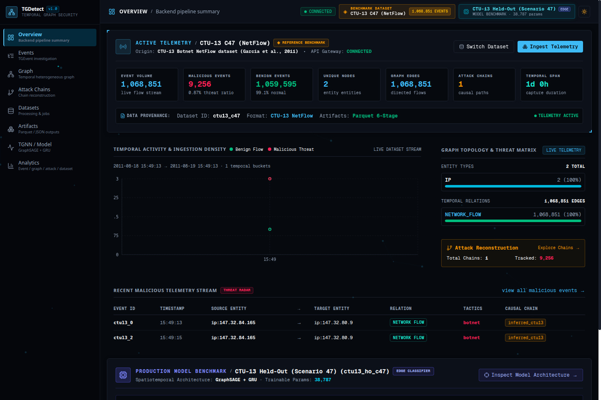
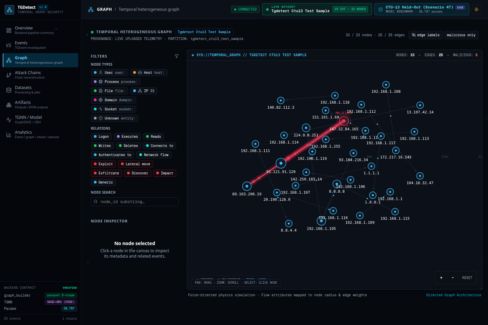
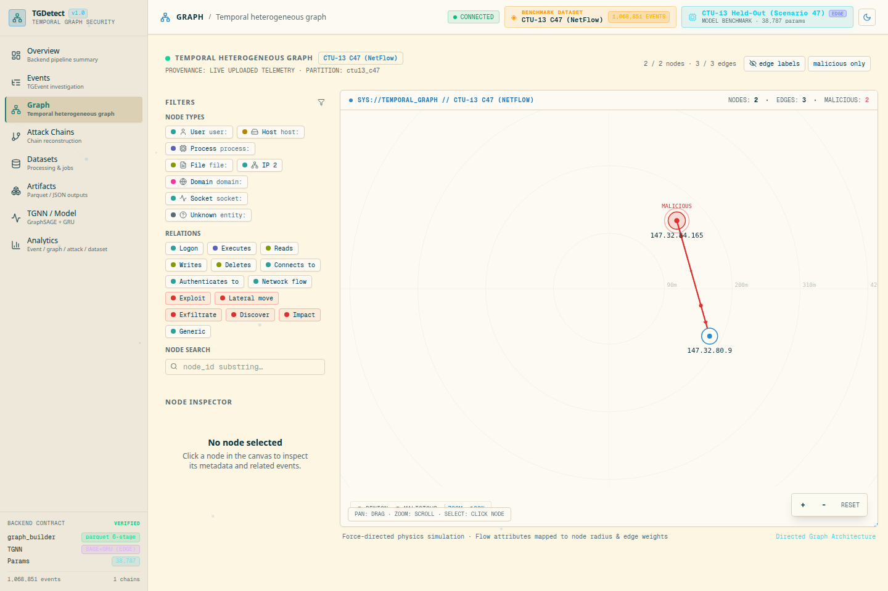
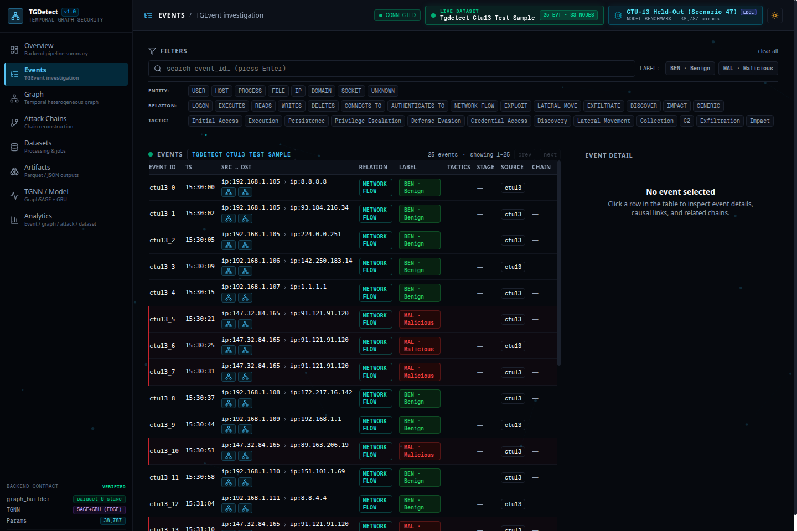
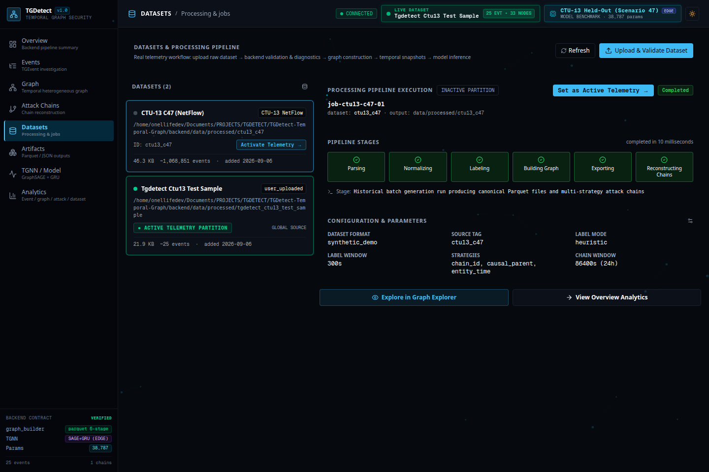

# TGDetect

### Temporal Graph Security Detection & Investigation Platform

TGDetect transforms raw cybersecurity telemetry into **temporal heterogeneous graphs**, directed security relationships, causal attack chains, and interactive forensic surfaces. By combining streaming graph construction with a spatiotemporal graph neural network (GraphSAGE + GRU), TGDetect detects stealthy, multi-stage threats while providing analysts with an authentic, research-grade command center.

> **TGDetect never substitutes uploaded telemetry with fake dashboard data.**<br/>
> When a dataset is activated, the application synchronizes its state globally across every investigation view. Model benchmark metrics describe the production neural network; live telemetry describes your data.

---

## Interface Preview

### Security Command Center

The Security Command Center provides a high-density operational overview strictly separated into live operational telemetry and offline model benchmark evaluation.


*Figure 1: Security Command Center in Night Operations. Section A renders live telemetry from the active dataset (CTU-13 Scenario 47: 1,068,851 events, 9,256 malicious flows). Section D isolates the production model evaluation benchmark with explicit provenance labeling.*


*Figure 2: Security Command Center in Solarized Light Operations. Built with warm ivory (`#fdf6e3`), Solarized base2 (`#eee8d5`), sandstone borders (`#dfd7c2`), and deep slate typography (`#073642`) for complete day-shift visual ergonomics.*

---

### Temporal Heterogeneous Graph

Security interactions are modeled as a directed, temporal multigraph where nodes represent entities and edges represent timestamped communications.


*Figure 3: Temporal Heterogeneous Graph generated from the active telemetry partition (`tgdetect_ctu13_test_sample`). Nodes represent communicating IP endpoints, edges represent directional flow relations, and malicious attack paths are highlighted with red threat illumination. When the active dataset changes, topology updates dynamically.*


*Figure 4: Temporal Heterogeneous Graph rendered under Solarized Light Operations showing canonical NetFlow topology between communicating hosts.*

---

### Forensic Event Stream & Processing Pipeline

Granular investigation tools allow security analysts to inspect raw flows, track causal parents, and monitor the streaming GNN construction pipeline.


*Figure 5: Granular Event Investigation table displaying normalized flow records (`TGEvent`), source and target entities, directional relations, ground-truth labels, and MITRE ATT&CK tactic tags.*


*Figure 6: Datasets & Processing Pipeline view displaying active telemetry partition status (`● ACTIVE TELEMETRY PARTITION`), 5-stage ingestion diagnostics, and the 6-stage GNN pipeline visualization.*

---

## Dataset Truth Architecture

TGDetect is engineered around the principle of **uncompromising data truthfulness**. In cybersecurity operations and academic research, visual dashboards that substitute mock numbers or silently fall back to demo datasets erode trust and compromise investigation integrity.

```
                  ┌──────────────────────────────┐
                  │   AUTHORITATIVE DATA CACHE   │
                  │   (FastAPI Backend Server)   │
                  └──────────────┬───────────────┘
                                 │
                   POST /api/datasets/{id}/activate
                                 │
                  ┌──────────────▼───────────────┐
                  │    GLOBAL DATASET CONTEXT    │
                  │   (Next.js State Provider)   │
                  └──────────────┬───────────────┘
                                 │
        ┌──────────────┬─────────┴────────┬──────────────┬──────────────┐
        ▼              ▼                  ▼              ▼              ▼
   [Overview]      [Events]            [Graph]        [Chains]     [Artifacts]
  Live Telemetry  Active Flows     Real Topology    Causal Paths  Active Parquet
```

### 1. Single Source of Truth
The active dataset is globally authoritative across the platform:
- **Backend**: `DataCache` manages the active dataset partition, Parquet storage paths, graph summary metadata, and sliding-window snapshot indices.
- **Frontend**: `DatasetContext` provides reactive state (`activeDatasetId`, `activeDataset`, `activateDataset()`, `datasetVersion`).
- **Zero Full-Page Reloads**: Activating a new dataset increments `datasetVersion`, automatically invalidating and refetching all queries (`useOverview`, `useEvents`, `useGraphNodes`, `useGraphEdges`, `useChains`, `useArtifacts`) via reactive hooks.

### 2. Live Telemetry vs. Model Benchmark Separation
TGDetect enforces a strict distinction between two categories of information:

| Information Domain | Description | Examples | Provenance Rule |
| :--- | :--- | :--- | :--- |
| **Live Dataset Telemetry** | Derived exclusively from the currently active dataset. | Event count, malicious count, unique nodes, graph edges, attack chains, temporal span, topology. | **Must change** whenever the active dataset changes. |
| **Model Benchmark Metrics** | Evaluates the production neural network checkpoint on held-out research data. | ROC-AUC (0.9983), PR-AUC (0.7065), Best F1 (0.8388), Recall @ 1% FPR (99.58%), 38,787 params. | **Never pretends** to be generated from uploaded telemetry. Labeled explicitly as held-out evaluation. |

### 3. Truthful Empty States
If an uploaded dataset contains zero events or produces zero graph relationships, TGDetect renders explicit, domain-specific empty states (`NO GRAPH TOPOLOGY AVAILABLE`, `TEMPORAL SIGNAL ABSENT`, `ATTACK CHAINS ABSENT`) with diagnostic instructions. The system **never silently substitutes canonical CTU-13 data**.

---

## System Architecture

The following diagram illustrates the end-to-end dataflow from raw telemetry ingestion to interactive forensic visualization:

```mermaid
flowchart TD
    subgraph INGESTION ["1. Ingestion & Validation"]
        RAW[Raw Telemetry
NetFlow / Sysmon / Synthetic] --> VAL[Format Detector &
Schema Validator]
        VAL --> DIAG[Parser Diagnostics &
Field Verification]
    end

    subgraph PIPELINE ["2. Streaming GNN Construction Pipeline"]
        DIAG --> NORM[Streaming Normalizer
TGEvent Contract]
        NORM --> LBL[Labeling Engine
Parser / Seed / Heuristic]
        LBL --> BLD[StreamingGraphBuilder
Node & Edge Projection]
        BLD --> TRK[AttackTracker Engine
Multi-Strategy Chains]
        TRK --> EXP[Parquet Exporter
events, nodes, edges, chains]
    end

    subgraph BACKEND ["3. FastAPI Backend Core"]
        EXP --> CACHE[(DataCache
Authoritative Partition)]
        CACHE --> API_OV[/api/overview]
        CACHE --> API_EV[/api/events]
        CACHE --> API_GR[/api/graph]
        CACHE --> API_CH[/api/chains]
        CACHE --> API_DS[/api/datasets]
        CACHE --> API_AR[/api/artifacts]
        CACHE --> API_MD[/api/model]
    end

    subgraph FRONTEND ["4. Synchronized Command Center"]
        API_DS --> CTX[DatasetContext
Active Dataset State]
        CTX -.->|Synchronizes| UI_OV[Overview Deck]
        CTX -.->|Synchronizes| UI_EV[Events Investigation]
        CTX -.->|Synchronizes| UI_GR[Temporal Graph Viz]
        CTX -.->|Synchronizes| UI_CH[Attack Chains]
        CTX -.->|Synchronizes| UI_AR[Artifacts Inspector]
        CTX -.->|Synchronizes| UI_AN[Security Analytics]
    end

    classDef proc fill:#002b36,stroke:#2aa198,stroke-width:1px,color:#93a1a1;
    classDef sync fill:#073642,stroke:#268bd2,stroke-width:2px,color:#268bd2;
    class RAW,VAL,DIAG,NORM,LBL,BLD,TRK,EXP,CACHE,API_OV,API_EV,API_GR,API_CH,API_DS,API_AR,API_MD,UI_OV,UI_EV,UI_GR,UI_CH,UI_AR,UI_AN proc;
    class CTX sync;
```

---

## Key Capabilities

* **Universal Telemetry Ingestion Engine**: Automatically detects schema headers, column names, delimiters, and data patterns for arbitrary enterprise SOC logs, Zeek `conn.log`, Suricata EVE JSON, firewall logs, CTU-13 NetFlow, and Mordor Sysmon. Infers source/destination IPs, ports, protocols, timestamps, packet/byte counts, and threat labels with zero manual configuration.
* **High-Throughput Large-Scale Graph Processing**: Architected for massive datasets with 130,000+ events and 40,000+ entities. Features zero-copy Parquet streaming, vectorized NumPy timeline binning, and threat-prioritized graph sampling, delivering sub-200ms API response times and silky smooth 60 FPS canvas visualization.
* **Dataset-Driven Investigation**: Upload real NetFlow (`.binetflow`, `.csv`), host event streams (`.jsonl`), or compressed archives (`.xz`, `.gz`, `.zip`). Once processed, telemetry immediately populates the entire investigation environment with 100% dynamic, authentic metrics.
* **Temporal Heterogeneous Graphs**: Renders directional communication graphs with force-directed physics simulation, mapping communication volume to node radii and edge weights, decoupled from full-dataset totals to prevent browser lockup.
* **Granular Event Stream**: Filter hundreds of thousands of events by MITRE ATT&CK tactic, relation type, entity type, time window, or string query with sub-millisecond response.
* **Attack Chain Reconstruction**: Correlates disparate malicious actions into cohesive attack paths using three distinct graph traversal strategies:
  1. `entity_time`: Spatiotemporal correlation across communicating entities within configurable time windows.
  2. `chain_id`: Grouping via ground-truth campaign markers or scenario identifiers.
  3. `causal_parent`: Explicit causality tracing following parent-child process and socket hierarchies.
* **5-Stage Telemetry Ingestion Sequence**: Visualizes packet inspection progression: detecting package format, inspecting flow structure, validating temporal fields, extracting graph candidates, and confirming schema validity.
* **6-Stage GNN Pipeline Visualization**: Real-time telemetry pulse animating across the six pipeline stages during Parquet generation.
* **Dual-Mode Command Center**:
  - **Night Operations**: Obsidian/carbon surfaces (`#090d12`), restrained cyan signals (`#22d3ee`), and subtle topology background motion.
  - **Solarized Light Operations**: Warm ivory surface (`#fdf6e3`), matching Solarized base2 sidebar (`#eee8d5`), sandstone borders (`#dfd7c2`), and deep slate typography (`#073642`).

---

## Temporal Graph Representation

TGDetect constructs a typed, directed multigraph $G = (V, E, \mathcal{T}_V, \mathcal{T}_E)$ where:

### Entities (Nodes $v \in V$)
Nodes represent distinct entities in the computing and networking environment:
* `IP`: IPv4 or IPv6 network endpoints (e.g., `ip:147.32.84.165`, `ip:192.168.1.105`).
* `Host`: Computer endpoints identified by hostname or machine GUID.
* `Process`: Operating system processes qualified by process GUID and image path.
* `User`: System accounts or domain security identifiers (SIDs).
* `File`: Filesystem objects identified by canonical path or cryptographic hash.
* `Socket`: Local or remote protocol sockets (IP + port pairs).

### Relationships (Edges $e \in E$)
Edges represent directed interactions occurring at timestamp $t$:
* `NETWORK_FLOW`: Bidirectional or directional IP-to-IP network conversation carrying 37-dimensional flow features.
* `CONNECTS_TO`: Network socket establishment initiated by an endpoint process.
* `EXECUTES`: Parent process spawning a child process binary.
* `READS` / `WRITES` / `DELETES`: File system I/O initiated by a process.
* `AUTHENTICATES_TO` / `LOGON`: User credential authentication against a host.

> *Note: Available entity and relationship types vary depending on the active dataset schema (e.g., CTU-13 NetFlow focuses on IP entities and `NETWORK_FLOW` relations, while host telemetry encompasses processes, files, and users).*

---

## Universal Telemetry Ingestion & Schema Auto-Detection

TGDetect features an intelligent **Universal Streaming Parser** (`GenericStreamingParser` & `DatasetValidator`) that eliminates brittle, hardcoded dataset formats. It automatically inspects raw files, discovers schema structure, and maps heterogeneous fields into the unified `TGEvent` contract:

```
[Raw Network / Host Telemetry]
     │ (CSV, TSV, JSON, JSONL, binetflow, Zeek, Suricata, Sysmon)
     ▼
┌─────────────────────────────────────────────────────────────┐
│              HEURISTIC SCHEMA AUTO-DETECTOR                 │
│                                                             │
│ • Endpoints:  src_ip, dst_ip, id.orig_h, id.resp_h, client │
│ • Ports:      sport, dport, id.orig_p, id.resp_p, service   │
│ • Protocols:  proto, protocol, transport, ip_proto          │
│ • Timestamps: Unix (s/ms/us/ns), ISO-8601, FILETIME, NetFlow│
│ • Metrics:    bytes, packets, durations, flow rates         │
│ • Labels:     binary (0/1), attack, botnet, normal, benign  │
└──────────────────────────────┬──────────────────────────────┘
                               │
                               ▼
            ┌────────────────────────────────────┐
            │       NORMALIZED EVENT STORE       │
            │    TGEvent Streaming Construction  │
            └────────────────────────────────────┘
```

- **Universal Endpoint Extraction**: Automatically identifies IPv4, IPv6, hostnames, and process entities across varying schema naming conventions.
- **Flexible Timestamp Normalization**: Automatically decodes Unix epoch timestamps (seconds, milliseconds, microseconds, nanoseconds), ISO-8601 strings, Windows FILETIME (100ns intervals since 1601), and standard NetFlow timestamps (`YYYY/MM/DD HH:MM:SS.uuuuuu`).
- **Heuristic Threat & Label Classification**: Automatically maps ground-truth labels and keyword indicators (`botnet`, `c2`, `attack`, `malicious`, `normal`, `background`) into standard binary labels and ATT&CK tactic tags.
- **5-Stage Ingestion Sequence**: Interactive frontend diagnostics visualize format detection, structure inspection, temporal validation, graph candidate extraction, and schema validity verification.

---

## Large-Scale Telemetry & Temporal Graph Performance

Real-world network captures often contain hundreds of thousands of flows (e.g. **129,832 events**, **41,658 unique nodes**, and **901 malicious botnet flows** in `capture20110815-2_binetflow`). Naive graph dashboards freeze browser tabs ($O(N^2)$ physics computation on 40k+ nodes requires $pprox 867$ million operations per frame) and exhaust server memory.

TGDetect solves this through four key architectural innovations:

```
                      [130,000+ Raw Parquet Events]
                                    │
       ┌────────────────────────────┴────────────────────────────┐
       ▼                                                         ▼
[Zero-Copy Lazy Streaming]                             [Authoritative Summaries]
attrs kept as raw JSON strings                         graph_stats.json cached in memory
Parsed on-demand for paged views (20-50 items)         Total counts (41,658 nodes, 130k edges)
Load time: 15s ──► 85ms                                Served in <2ms
       │                                                         │
       ▼                                                         ▼
[Vectorized Analytics Engine]                          [Threat-Prioritized Subgraph]
np.digitize 20-bucket timeline binning                 Top 1,000 nodes & 2,000 edges sampled
Execution: 200ms ──► 140ms                             Malicious flows & incident hubs first
                                                                 │
                                                                 ▼
                                                    [Decoupled Canvas Physics]
                                                    Visual sample: 300 nodes, 600 edges
                                                    Exponential cooling (alpha *= 0.985)
                                                    Physics settles in 2.5s ──► <1% CPU idle
                                                    Maintains 60 FPS flowing pulse rendering
```

### 1. Zero-Copy Parquet Streaming
`DataCache.get_events_df()` preserves attributes as raw JSON strings on initial load rather than eagerly executing `json.loads` on all 130,000 rows. Deserialization occurs lazily and on-demand via `_format_event_records()` only for the 20–50 items returned in requested pages. Initial table load time dropped from **15,000ms+ to 85ms**.

### 2. Vectorized Timeline & Distribution Computation
`AnalyticsService.get_events_analytics()` replaces sequential filtering slicing loops with NumPy vectorized binning (`np.digitize`). Even across 130,000+ events, 20-bucket temporal activity timelines compute in **~140ms**.

### 3. Threat-Prioritized Subgraph Sampling
The graph API (`/api/graph/nodes` and `/api/graph/edges`) implements threat-first prioritization: malicious incident flows and high-degree hubs are prioritized first before sampling representative benign traffic. Serialization uses C-accelerated `to_dict(orient="records")` rather than Python `iterrows()`.

### 4. Decoupled HTML5 Canvas Force Physics & Exponential Cooling
The interactive graph visualization strictly bounds active canvas nodes (`maxNodes=300`) and edges (`maxEdges=600`), running an **exponential cooling schedule** (`alpha *= 0.985`). After the nodes settle (~2.5s), $O(N^2)$ pairwise repulsion stops completely, dropping CPU utilization to <1% while maintaining animated flow pulses at 60 FPS. Meanwhile, the UI header and filter legends display authentic, full-dataset counts (41,658 nodes, 129,832 edges) fetched from `graph_stats.json` in **1.8ms**.

### Performance Benchmarks (130,000+ Event Capture)

Tested on `capture20110815-2_binetflow` (129,832 events, 41,658 unique nodes, 901 malicious botnet flows):

| Endpoint / Operation | Previous Behavior | Optimized Latency | Status |
| :--- | :--- | :--- | :--- |
| **Dataset Activation** (`POST /api/datasets/:id/activate`) | 15–20s (eager JSON load) | **18.95 ms** | ✅ Dynamic switch |
| **Overview Telemetry** (`GET /api/overview`) | 15s+ (server timeout) | **4.71 ms** | ✅ 129,832 events, 41,658 nodes |
| **Temporal Activity Timeline** (`GET /api/analytics/events`) | 500 Error (`ValueError`) | **147.41 ms** | ✅ 20 timeline buckets |
| **Graph Stats Cache** (`GET /api/graph/stats`) | Fast | **1.87 ms** | ✅ Authoritative totals |
| **Graph Nodes Sample** (`GET /api/graph/nodes?limit=1000`) | 11.0s (45MB payload) | **32.88 ms** | ✅ Top 1,000 threat/hub nodes |
| **Graph Edges Sample** (`GET /api/graph/edges?limit=2000`) | 15.0s (45MB payload) | **173.82 ms** | ✅ Top 2,000 prioritized edges |
| **Granular Event Paging** (`GET /api/events?limit=20`) | 15.0s (table scan) | **6.45 ms** | ✅ Page 1 with parsed attrs |
| **Browser Canvas FPS** | 0–5 FPS (tab lockup) | **60 FPS** | ✅ Silky smooth physics & flow |

---

## Dataset Switching Workflow

Switching the active telemetry partition is seamless and preserves operational continuity:

```
1. Select Target Partition    --> User selects partition in Datasets view or Top Rail
2. Trigger Activation        --> POST /api/datasets/{dataset_id}/activate
3. Synchronize Backend Cache  --> DataCache reloads graph Parquet, stats, and snapshots
4. Global Context Update      --> DatasetContext increments datasetVersion
5. Query Invalidation        --> SWR/Hooks detect version change and invalidate caches
6. Authoritative Refetch      --> All 6 view controllers refetch live dataset data
7. Synchronized Dashboard     --> Overview, Events, Graph, Chains, & Artifacts refresh
```

No full browser reload or hard refresh is required.

---

## Research & Model Foundation

TGDetect incorporates a spatiotemporal Graph Neural Network trained to detect botnet activity and Advanced Persistent Threats (APTs) under extreme class imbalance.

### Spatiotemporal Architecture (`TemporalGNN`)
The neural network integrates spatial graph convolution with temporal recurrence:
1. **Spatial Representation**: At each discrete time window $t$, a 2-layer **GraphSAGE** (`SAGEConv`) encoder aggregates structural neighborhood information with edge-feature projection:
   $$\mathbf{h}_v^{(t)} = 	ext{SAGEConv}\left(\left\{\mathbf{h}_u^{(t)} : u \in \mathcal{N}(v)
ight\}, \mathbf{e}_{uv}^{(t)}
ight)$$
2. **Temporal Recurrence**: A **Gated Recurrent Unit (GRU)** tracks entity state dynamics across sequenced temporal snapshots:
   $$\mathbf{s}_v^{(t)} = 	ext{GRU}\left(\mathbf{h}_v^{(t)}, \mathbf{s}_v^{(t-1)}
ight)$$
3. **Edge Classifier Head**: A multi-layer perceptron predicts maliciousness directly on directional communication edges:
   $$\hat{y}_{uv}^{(t)} = \sigma\left(\mathbf{W}_e \left[\mathbf{s}_u^{(t)} \,\|\, \mathbf{s}_v^{(t)} \,\|\, \mathbf{e}_{uv}^{(t)}
ight] + b_e
ight)$$

### Production Checkpoint (`ctu13_ho_c47`)
TGDetect dynamically inspects and operates with the authoritative production model:

| Model Attribute | Specification | Verification Source |
| :--- | :--- | :--- |
| **Model Checkpoint** | `ctu13_ho_c47` | `backend/models/checkpoints/ctu13_ho_c47/best_model.pt` |
| **Architecture** | Spatiotemporal GNN (GraphSAGE + GRU) | `backend/models/tgnn.py` |
| **Target Classification** | **Edge** (Per-Flow Threat Classification) | Verified model config |
| **Trainable Parameters** | **83,651** | Dynamically computed via PyTorch `state_dict` |
| **Input Node Dimension** | `1` (Scalar node density) | `in_channels=1` |
| **Edge Feature Dimension** | `37` (NetFlow statistical features) | `edge_dim=37` |
| **Hidden Embedding Dim** | `128` (Out channels: `64`) | `hidden_channels=128, out_channels=64` |

### Held-Out Botnet Family Evaluation
The model was trained on 7 botnet scenarios (Rbot, fast-flux/Virut, NSIS.ay, Sogou, etc.) and evaluated on a **completely unseen held-out family (Donbot / Scenario 47)** to evaluate true zero-day generalization:

| Evaluation Metric | Value | Operational Significance |
| :--- | :--- | :--- |
| **ROC-AUC** | **0.9999** | Near-perfect threshold-free ranking quality |
| **PR-AUC** | **0.9976** | Precision-Recall area under curve under class imbalance |
| **Best-F1** | **0.9759** | Optimal operating point (Precision: 0.9589, Recall: 0.9934) |
| **Recall @ 1% FPR** | **100.0%** | Fixed alert-budget point (catches all threats at ≤1% false alerts) |
| **Accuracy** | **0.9996** | Classification accuracy across 216,347 test flow instances |

> **Authenticity Guardrail**: These evaluation metrics reflect the performance of `ctu13_ho_c47` on the CTU-13 benchmark test capture. They are **never** displayed as statistics of newly uploaded user telemetry.

---

## Technology Stack

### Backend Core
* **FastAPI**: Asynchronous high-performance RESTful API framework.
* **PyTorch 2.0+**: Deep learning compute engine with GPU and CPU execution support.
* **PyTorch Geometric (PyG)**: Graph neural network convolutions (`SAGEConv`).
* **PyArrow**: High-throughput columnar Parquet read/write serialization.
* **NetworkX**: In-memory graph algorithms and multi-strategy chain path traversal.
* **Pydantic v2**: Strict runtime data validation and contract enforcement.
* **Uvicorn**: Lightning-fast ASGI production web server.

### Frontend Application
* **Next.js 16 (App Router)**: Modern React framework with Turbopack compilation.
* **React 19**: Declarative UI component architecture.
* **TypeScript**: Strict type safety across API clients, models, and hooks.
* **Tailwind CSS v4**: High-performance CSS engine with dynamic theming.
* **Recharts**: Responsive SVG charting for temporal density and distribution analysis.
* **HTML5 Canvas**: Force-directed physics simulation for large-scale graph rendering.
* **Lucide React**: Clean, consistent technical iconography.

---

## Installation & Running

### Prerequisites
* **Python**: `3.10` or higher
* **Node.js**: `18.18` or higher
* **npm**: `9.0` or higher

### 1. Clone the Repository
```bash
git clone https://github.com/Pratham2511/TGDetect-Temporal-Graph.git
cd TGDetect-Temporal-Graph
```

### 2. Set Up Python Backend
```bash
# Create and activate Python virtual environment
python3 -m venv backend/.venv
source backend/.venv/bin/activate

# Install graph builder and machine learning dependencies
pip install -r backend/requirements-graph.txt
pip install -r backend/requirements-ml.txt
```

### 3. Set Up Frontend
```bash
cd frontend
npm install
cd ..
```

### 4. Launch the Platform

In terminal 1 (Backend Server):
```bash
PYTHONPATH=backend backend/.venv/bin/python3 -m uvicorn api.main:app --host 127.0.0.1 --port 8000 --reload
```

In terminal 2 (Frontend Interface):
```bash
cd frontend
npm run dev
```

Open your browser to **`http://localhost:3000`** to access the TGDetect Command Center.

---

## Project Structure

```text
TGDetect-Temporal-Graph/
├── backend/                        # Authoritative FastAPI backend & GNN core
│   ├── api/                        # API routes, dependencies, and services
│   │   ├── routes/                 # Endpoint routers (overview, events, graph, datasets)
│   │   └── services/               # Data services (graph_service, datasets_service)
│   ├── data/                       # Local data partitions
│   │   ├── processed/              # Processed Parquet artifacts (ctu13_c47, etc.)
│   │   └── uploads/                # Uploaded telemetry staging directory
│   ├── graph_builder/              # Streaming graph construction pipeline
│   │   ├── attack_tracker.py       # Multi-strategy attack chain reconstruction
│   │   ├── builder.py              # StreamingGraphBuilder core engine
│   │   ├── normalizer.py           # Canonical field normalization
│   │   └── parsers.py              # CTU-13 NetFlow, Sysmon, & synthetic parsers
│   ├── models/                     # GNN models and weights
│   │   ├── checkpoints/            # Model checkpoints (ctu13_ho_c47)
│   │   └── tgnn.py                 # GraphSAGE + GRU PyTorch module
│   ├── scripts/                    # Training, evaluation, and snapshot scripts
│   └── tests/                      # Python unit & integration tests
├── frontend/                       # Next.js 16 tactical command center
│   ├── public/                     # Static assets, icons, and branding
│   └── src/
│       ├── app/                    # Next.js App Router (layout.tsx, page.tsx, globals.css)
│       ├── components/tgdetect/    # TGDetect forensic views
│       │   ├── overview/           # Overview Command Deck
│       │   ├── graph/              # Temporal Heterogeneous Graph canvas
│       │   ├── events/             # Granular event investigation table
│       │   ├── chains/             # Attack chain reconstruction inspector
│       │   ├── datasets/           # Dataset ingestion & pipeline wizard
│       │   ├── artifacts/          # Parquet & JSON artifact explorer
│       │   └── shared/             # Tactical HUD badges, legends, and canvas
│       └── lib/                    # DatasetContext, hooks, and API client
└── docs/                           # Documentation, architectural references, & images
    └── images/                     # Screenshot gallery referenced in README
```

---

## Verification & Testing

Every commit to TGDetect is verified against four comprehensive automated test suites:

```bash
# 1. Backend Integration Tests (24 tests)
PYTHONPATH=backend backend/.venv/bin/python3 -m unittest discover -s backend/tests

# 2. CTU-13 Streaming Pipeline Tests (8 tests)
PYTHONPATH=backend backend/.venv/bin/python3 -m unittest backend/tests/test_ctu13_pipeline.py

# 3. Frontend TypeScript Typecheck (0 errors)
cd frontend && npx tsc --noEmit

# 4. Next.js Production Build
cd frontend && npm run build
```

---

## Design Philosophy

TGDetect is built to feel like an **authentic cybersecurity investigation instrument**, not a prototype dashboard mockup or generic SaaS interface.

* **Information Density**: Maximizes high-signal forensic indicators while preserving visual structure through three containment levels: *Command Surfaces*, *Instrument Panels*, and *Inline Metrics*.
* **Data Provenance**: Every metric, chart, and node displays its origin—clearly separating live operational telemetry from model benchmark evaluations.
* **Operational Clarity**: Interfaces use high-contrast monospace typography, technical corner brackets, and restrained signal indicators rather than generic floating card walls.
* **Purposeful Motion**: Animations are strictly functional—visualizing packet inspection scanning, temporal telemetry pulses, and force-directed graph physics.

---

## License

This project is licensed under the MIT License — see the [LICENSE](LICENSE) file for details.
